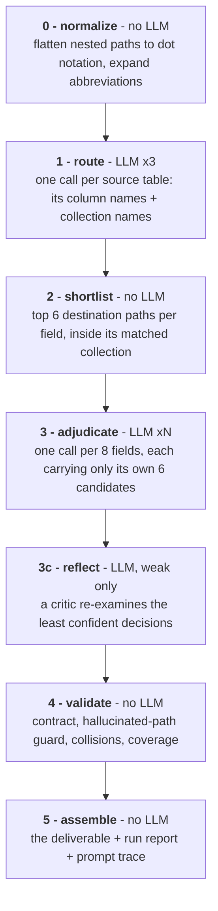
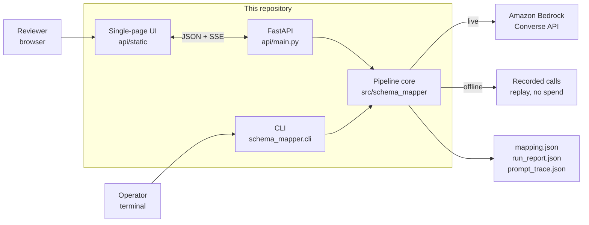

# Schema Field Mapper

An **AI pipeline** that maps **every field** of a legacy MySQL HR schema (`legacy_hrm`) to its
semantic equivalent in a MongoDB people-platform schema (`people_platform`), producing one
reviewable JSON document.

Retrieval narrows each column to its few plausible destinations, a language model on Amazon
Bedrock judges only that shortlist, and a critic pass re-examines the weakest decisions. Three
of the six stages use no model at all, which is what makes the result auditable.

Developed by **Raviteja Ainampudi**. Assignment text: `InterviewAssignment.txt`.

## What it does and why that is useful

Moving a relational schema to documents means deciding, for every single column, where it
lands and how its type and values convert. Done by hand it is slow and easy to get subtly
wrong; done by one large LLM prompt it is unverifiable. This produces, per column:

- the destination path in dot notation (`f_name` → `fullName.firstName`),
- the type transform (`TINYINT(1) -> Boolean`, `CHAR(1) code -> String enum`),
- a confidence score that is **blended**, not the model's self-report,
- one plain-English sentence of reasoning,
- and a note for anything lossy or needing migration work — or an honest declaration that a
  column has no destination at all.

The result is a migration artifact you can review, not a black-box answer: every decision
exposes the candidate shortlist it beat, the score components, and the model pass that
decided it.

## The constraint, and how it is satisfied

The assignment forbids passing both schemas to an LLM in one prompt and taking the result as
the finished mapping. The work is therefore decomposed into six stages, four of which use no
LLM at all:



The AI design, in one list: **retrieval before generation** (the model only ever picks from a
scored shortlist, so it cannot name a path it was never shown), an **orchestrator with narrow
workers** (deterministic code owns control flow and batching), a **model cascade** (cheap model
first, escalate only low confidence), an **evaluator–optimizer** reflection pass over the
weakest decisions, **constrained JSON decoding** followed by verification against the real
schema, and a **blended confidence** score that mixes the model's self-report with the
retrieval margin. No embeddings or vector store: at this schema size the lexical and structural
signals retrieved better, so a vector database would add a dependency for no measurable recall.

## How the pieces fit



The UI is a client of the HTTP API, and the API runs the same pipeline the CLI runs, so a
browser run and a terminal run cannot disagree. More diagrams — components, data model,
deployment, the per-field decision lifecycle, confidence, cost control — are in
[docs/ARCHITECTURE.md](docs/ARCHITECTURE.md) and [docs/PIPELINE.md](docs/PIPELINE.md).

## Machine-checked constraint proof

This is **machine-checked, not asserted**. Every request is recorded with a manifest, and
tests assert that no single prompt carried all 34 source fields or all 40 destination paths,
and that no single response produced more than one table's mappings. The interface shows the
same numbers live under **Constraint proof**.

## Quickstart

Python 3.12+. A `.venv` is not portable between Windows and WSL/Linux; each script replaces
a foreign one.

```powershell
.\scripts\setup_venv.ps1          # Windows
.\.venv\Scripts\Activate.ps1
```

```bash
bash scripts/setup_venv.sh        # WSL / Linux / macOS
source .venv/bin/activate
```

Then, with no AWS account and no spend:

```bash
bash scripts/dev.sh offline       # replay recordings, regenerate the committed artifact
bash scripts/dev.sh test          # the full test suite
bash scripts/dev.sh api           # the interface at http://localhost:8000
```

For a live Bedrock run, copy `.env.sample` to `.env`, fill in the AWS values, verify access
with `bash scripts/dev.sh bedrock`, then `bash scripts/dev.sh run`. Never commit `.env`.

Full walkthrough: [docs/QUICKSTART.md](docs/QUICKSTART.md).

## Results on the assignment schemas

| | |
| --- | --- |
| Coverage | 33 of 34 source fields mapped; `dob` declared unmapped, with a reason |
| Destination | 33 of 40 leaf paths targeted; the 7 others are denormalized copies a migration fills by joining |
| Mean confidence | 0.865 |
| LLM calls | 11 |
| Cost | about $0.04 per live run with the default cascade |
| Validation | contract, coverage, and every path in-schema: passing |
| Tests | 264, all offline |

Deliverable: [`outputs/mapping_legacy_hrm_to_people_platform.json`](outputs/mapping_legacy_hrm_to_people_platform.json),
alongside `run_report.json` and `prompt_trace.json`.

## Interface

An interactive mapping graph rather than a data grid: source columns on the left,
destination leaf paths on the right, one wire per decision coloured by confidence, animating
in as batches resolve over SSE. Bring your own schemas by paste, drag-and-drop, upload, or a
bundled sample — four formats are accepted and detected from the content.

Guides: [docs/USAGE.md](docs/USAGE.md) · [docs/INPUT_FORMATS.md](docs/INPUT_FORMATS.md)

## Testing it directly over the API

The interface is a client of a plain HTTP API, and that API runs the same pipeline the CLI
runs. With the server up: **<http://localhost:8000/docs>** (Swagger UI, runs any endpoint
from the browser), `/redoc`, `/openapi.json`.

```bash
# validate your own schema, free and without a model call
curl -X POST localhost:8000/api/parse -H 'content-type: application/json' \
  -d '{"source_text": "CREATE TABLE t (id INT PRIMARY KEY);"}'

# run the pipeline, streaming progress
curl -N -X POST localhost:8000/api/run -H 'content-type: application/json' \
  -d '{"offline": true}'
```

Reference: [docs/API.md](docs/API.md).

## Documentation

| Document | Contents |
| --- | --- |
| [docs/QUICKSTART.md](docs/QUICKSTART.md) | Setup, first run, troubleshooting |
| [docs/USAGE.md](docs/USAGE.md) | The interface, panel by panel, with a user-journey diagram |
| [docs/INPUT_FORMATS.md](docs/INPUT_FORMATS.md) | The four accepted formats, with examples |
| [docs/API.md](docs/API.md) | HTTP endpoints, CLI flags, smoke scripts, request lifecycle |
| [docs/ARCHITECTURE.md](docs/ARCHITECTURE.md) | System context, components, data model, deployment |
| [docs/PIPELINE.md](docs/PIPELINE.md) | The six stages, run sequence, decision states, cost control |
| [project_plans/schema_field_mapper_plan.md](project_plans/schema_field_mapper_plan.md) | Design, cost model, deployment, acceptance criteria |

## Deliverables

- **Working pipeline code** — `src/schema_mapper/`, runnable with no AWS account via offline replay.
- **Generated mapping JSON** — committed under `outputs/`, produced by a real Bedrock run.
- **Write-up** — `docs/WRITEUP.md` (pending).

## Agent notes

- Coding agents: `AGENTS.md`
- Durable decision log: `MEMORY.md`
