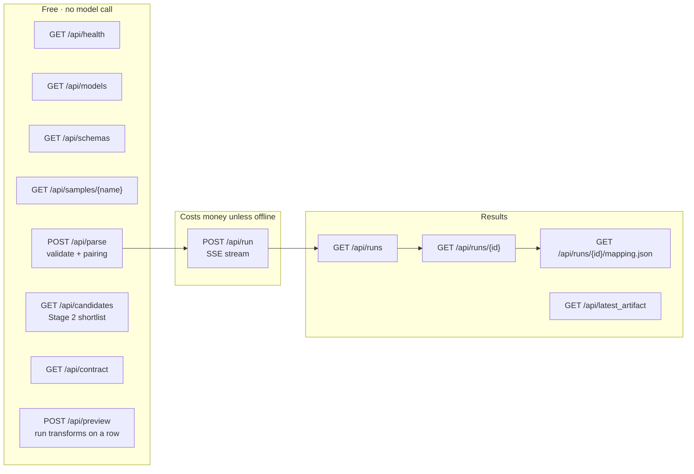
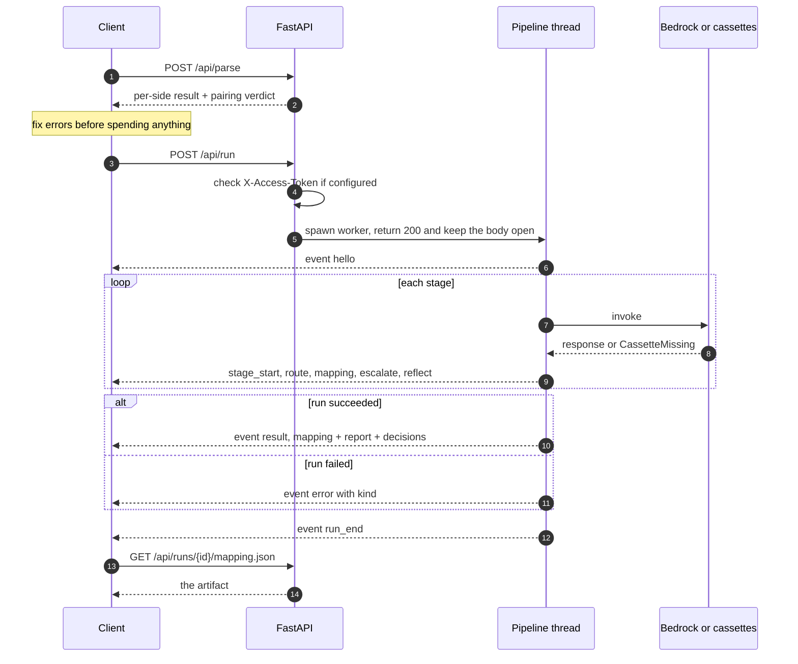

# API and CLI

Everything the interface does goes through this HTTP API, and the API runs the same
`Pipeline` class the CLI runs — there is no separate "web" mapping path that could drift
from the committed artifact.

## Shape of the API



The split matters when testing: everything except `POST /api/run` is free and unauthenticated,
so you can validate schemas, inspect shortlists, and execute transforms as often as you like
without spending anything.

## A run over HTTP



## Interactive reference

With the server running (`bash scripts/dev.sh api`):

| URL | What it is |
| --- | --- |
| <http://localhost:8000/docs> | Swagger UI — run any endpoint from the browser, no setup |
| <http://localhost:8000/redoc> | ReDoc — easier to read end to end |
| <http://localhost:8000/openapi.json> | Machine-readable OpenAPI schema |

Swagger UI is the fastest way to test with your own data: expand `POST /api/parse`, paste
your schema into `source_text`, and execute.

## Authentication

None by default, so local use needs no setup. If `APP_ACCESS_TOKEN` is set to anything
other than the placeholder, `POST /api/run` requires it:

```bash
curl -X POST localhost:8000/api/run -H 'X-Access-Token: your-token' \
  -H 'content-type: application/json' -d '{"offline": true}'
```

Only the run endpoint is gated, because it is the only one that can spend money.

## Endpoints

### Metadata

| Endpoint | Returns |
| --- | --- |
| `GET /api/health` | Status, region, whether offline replay is available and how many cassettes, whether auth is on, default models, and the pinned thresholds |
| `GET /api/models` | Model registry with per-million-token input and output prices, so cost can be shown before a run |
| `GET /api/schemas` | The two bundled schemas as text, the sample list, and the accepted formats |
| `GET /api/samples/{name}` | One sample file's text. Reads are contained to `data/samples/` |
| `GET /api/contract` | The JSON Schema the output document is validated against |
| `GET /api/sample_rows?table=emp_master` | Real rows used by the transform preview |

### `POST /api/parse` — validate input, free

No model call, so use it as much as you like. Either field may be omitted to mean "use the
bundled default".

```bash
curl -X POST localhost:8000/api/parse -H 'content-type: application/json' -d '{
  "source_text": "CREATE TABLE t (id INT PRIMARY KEY, f_name VARCHAR(60) COMMENT \"given name\");"
}'
```

```json
{
  "ok": true,
  "source": {
    "ok": true, "used": "pasted", "chars": 78, "database": "source",
    "dialect": "MySQL (Relational)", "format": "mysql_ddl",
    "containers": { "t": 2 }, "fields": 2
  },
  "destination": { "ok": true, "used": "bundled default", "chars": 0 }
}
```

On bad input, that side reports `"ok": false` with an actionable `error`, for example
`Invalid JSON at line 1, column 23: Expecting value`. See
[INPUT_FORMATS.md](INPUT_FORMATS.md) for what is accepted.

When both sides resolve — pasted or bundled — the response also carries a **`pairing`**
block answering a different question: do these two schemas belong together? Both halves can
parse perfectly and still be a mismatch, and a mismatched run does not fail, it just maps
books onto departments.

```json
{
  "pairing": {
    "score": 0.418,
    "verdict": "weak",
    "headline": "These schemas only partly overlap.",
    "detail": "1 of 3 source tables has no clearly matching collection, so the closest available is forced (bk_master → departments). ...",
    "placed_fields": 20,
    "total_fields": 31,
    "pairings": [
      { "table": "brnch", "collection": "locations", "affinity": 0.534, "fields": 8, "placed_fields": 6 }
    ]
  }
}
```

`verdict` is one of `aligned`, `weak`, or `unrelated`, and `pairings` is a free preview of
the routing Stage 1 will most likely choose. It is deterministic and model-free, so it is
safe to call on every keystroke. Thresholds are calibrated by `scripts/eval_pairing.py`;
because the margin is narrow this is a warning, never a block.

### `GET /api/candidates` — the deterministic shortlist

The Stage 2 output for one field, with the score components that produced the ranking. No
model call. This is the honest answer to "how do you know it is not hallucinating?": the
model only ever chooses from this list.

```bash
curl 'localhost:8000/api/candidates?table=dept_info&field=dept_stat&collection=departments&top_k=4'
```

`table`, `field`, and `collection` are required; `top_k` defaults to 6. This endpoint scores
against the **bundled** schemas, so it is for inspection rather than for your own pasted
input.

### `POST /api/run` — run the pipeline (Server-Sent Events)

Streams progress rather than blocking, because a run makes a dozen sequential model calls.
`POST` is used deliberately: `EventSource` is GET-only and would force run state onto the
server, so the browser posts its full configuration and reads the stream back.

```bash
curl -N -X POST localhost:8000/api/run -H 'content-type: application/json' -d '{
  "offline": true,
  "enable_cascade": true,
  "enable_reflection": true,
  "batch_size": 8,
  "top_k": 6
}'
```

Request fields, all optional: `source_text`, `destination_text`, `router_model`,
`mapper_model`, `cheap_mapper_model`, `enable_cascade`, `enable_reflection`,
`enable_cache`, `offline`, `batch_size` (1–20), `top_k` (2–15).

Event stream, in order:

| Event | Payload |
| --- | --- |
| `hello` | Parsed schemas, field and path inventories, chosen models, mode |
| `run_start`, `stage_start`, `stage_end` | Stage lifecycle with durations |
| `route` | One table paired to a collection, with confidence |
| `batch` | Which fields are in flight |
| `escalate` | Fields the cascade sent to the strong model |
| `reflect` | A field the critic pass re-examined |
| `mapping` | One resolved decision — this is what animates a wire |
| `result` | Final `mapping`, `report`, `decisions`, `run_id` |
| `error` | Failure with its kind; never silently swallowed |
| `run_end` | Terminator |

`offline: true` replays recorded cassettes: no credentials, no spend. The reported cost is
the *recorded* cost with `"billed": false`, rather than a misleading zero.

### `POST /api/preview` — execute the transforms

Applies the mapped transforms to one real row and returns the resulting document, with each
output field annotated by the rule that produced it. Anything not mechanically executable
(ObjectId generation, denormalized lookups) is flagged as manual rather than faked.

`row` and `mappings` are required; `table` and `collection` default to `emp_master` and
`employees`. Each mapping needs only `source_field` and `destination_field` — the transform
is derived from the real types, not taken from the request.

```bash
curl -X POST localhost:8000/api/preview -H 'content-type: application/json' -d '{
  "table": "emp_master", "collection": "employees",
  "row": { "rec_stat": "A", "is_remote": 1 },
  "mappings": [
    { "source_field": "rec_stat",   "destination_field": "employment.status" },
    { "source_field": "is_remote",  "destination_field": "employment.isRemote" }
  ]
}'
```

Returns the built `document`, per-path `annotations` (`rule`, `manual`, `detail`), and a
`manual_count`.

### History

| Endpoint | Returns |
| --- | --- |
| `GET /api/runs` | Recent runs: id, mode, coverage, mean confidence, cost, models, pass/fail |
| `GET /api/runs/{run_id}` | That run's full mapping, report, and decisions |
| `GET /api/runs/{run_id}/mapping.json` | Just the mapping document, as a download |
| `GET /api/latest_artifact` | The committed artifact, so a cold page load is not empty |

History is a bounded in-memory map (25 runs) and is lost on restart.

## CLI

Same pipeline, no browser. Writes `mapping_<source>_to_<destination>.json`,
`run_report.json`, and `prompt_trace.json` into `outputs/`.

```bash
python -m schema_mapper.cli --offline                  # replay cassettes, no AWS
python -m schema_mapper.cli                            # live Bedrock run
python -m schema_mapper.cli --record                   # live run, record cassettes
python -m schema_mapper.cli --source my.sql --destination my.json
python -m schema_mapper.cli --mapper-model us.amazon.nova-lite-v1:0 --no-cascade
```

Useful flags: `--offline`, `--record`, `--source`, `--destination`, `--output`,
`--router-model`, `--mapper-model`, `--cheap-mapper-model`, `--no-cascade`,
`--no-reflection`, `--no-cache`, `--batch-size`, `--top-k`, `--quiet`, `--verbose`.

Exit codes are meaningful, so this is safe in CI: **0** success, **1** validation or
coverage failure, **2** configuration or Bedrock error. A failed run exits non-zero
specifically so it cannot quietly overwrite a good committed artifact.

Wrappers, which handle `PYTHONPATH` and the venv for you:

```bash
bash scripts/dev.sh offline | run | record | test | eval | bedrock | api | serve | check | lint
```

Two evaluation scripts run offline and free, and both fail loudly rather than printing a
number you have to interpret:

```bash
python scripts/eval_retrieval.py            # Stage 2 shortlist recall against the oracle
python scripts/eval_pairing.py              # mismatched-pair thresholds, all combinations
python scripts/eval_pairing.py --tables     # per-table affinity, for tuning
python scripts/show_mapping.py <artifact>   # read a mapping document as a table
```

## Smoke scripts

```bash
bash scripts/smoke_api.sh  http://127.0.0.1:8000   # every endpoint + a full SSE run
bash scripts/smoke_input.sh http://127.0.0.1:8000  # samples parse; bad input is rejected
bash scripts/check_ui.sh   http://127.0.0.1:8000   # UI wiring + endpoint reachability
```

## Deployment note

`api/main.py` exposes `handler = app` and writes only through `config.output_dir()`, which
returns `/tmp/schema_mapper` under Lambda. Nothing writes next to its source module, so the
same artifact runs locally and in a read-only Lambda task root.
