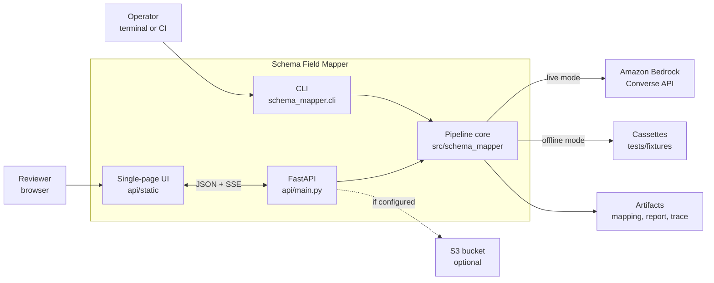
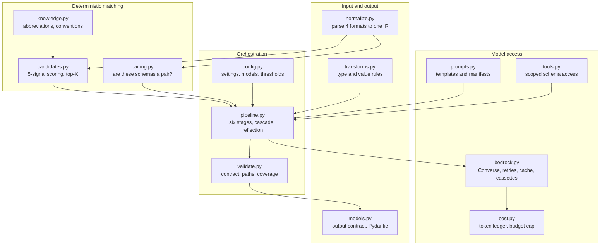
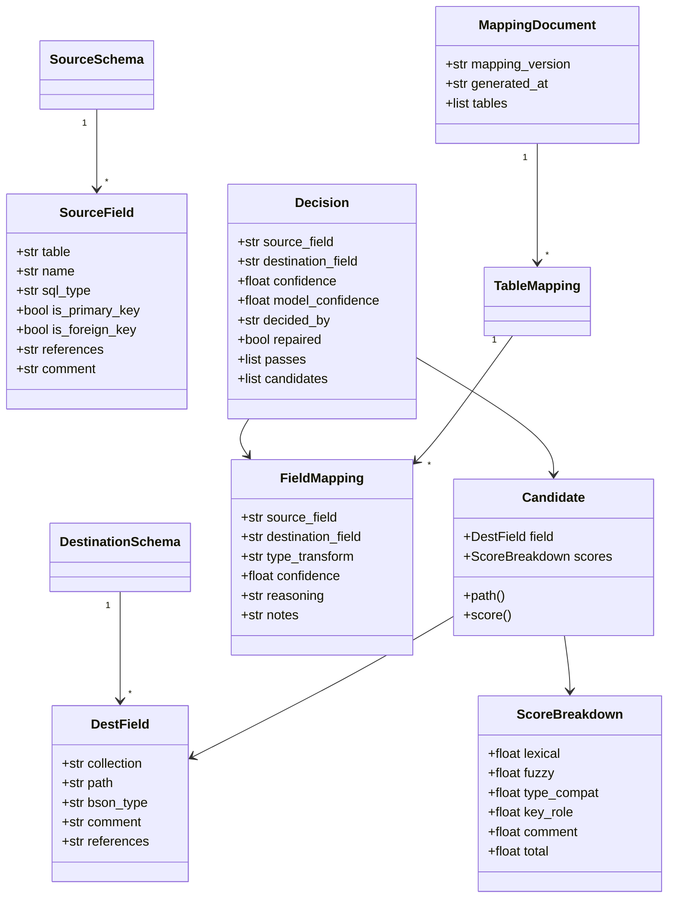
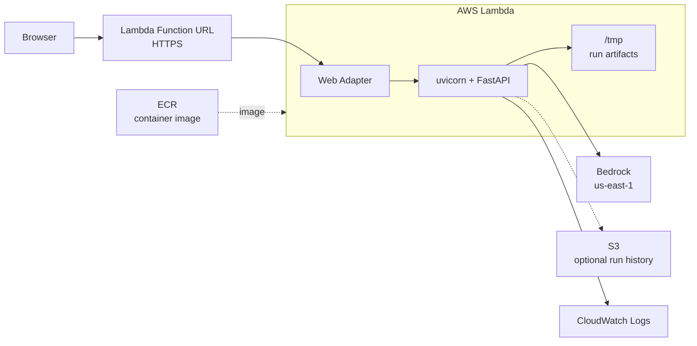
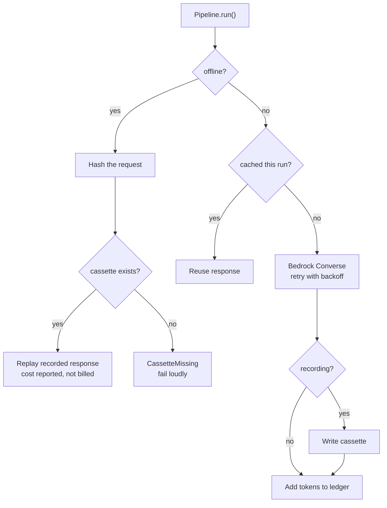

# Architecture

How the system is put together, and why it is shaped this way. For the stage-by-stage
workflow see [PIPELINE.md](PIPELINE.md); for endpoints see [API.md](API.md).

All diagrams are Mermaid, so they render on GitHub and in most editors.

## The constraint that shapes everything

The assignment forbids handing both schemas to a model in one prompt and treating the reply
as the finished mapping. That single rule is why this is a pipeline rather than a prompt, and
why four of its six stages contain no model call at all. Every structural decision below
traces back to it: prompts are small because a prompt only ever sees one table's columns and
one field's candidates; the output is verifiable because the parts a model cannot be trusted
with — flattening, retrieval, validation, assembly — are ordinary code.

## System context

Two entry points, one engine. The UI is a client of the HTTP API, and the API runs the same
`Pipeline` class the CLI runs, so a browser run and a terminal run cannot produce different
mappings. That mattered more than it sounds: the committed deliverable comes from the CLI,
and a demo that quietly used a different code path would make the artifact unverifiable.

## Components

Notable boundaries:

- **`tools.py` exists to make the constraint structural rather than a promise.** The pipeline
  reaches the schemas through a scoped accessor that hands out one table's column names, or
  one field's candidates — never the whole schema. Code that cannot fetch both schemas cannot
  accidentally put both in a prompt.
- **`bedrock.py` owns everything unreliable about a model call**: retries with backoff,
  token accounting, response caching, and cassette record and replay. The pipeline sees one
  method, `invoke`, and never learns whether the answer came from AWS or a recording.
- **`normalize.py` is the only module that knows about input formats.** Everything downstream
  works on `SourceSchema` and `DestinationSchema`, which is why adding the two terse input
  forms needed no changes anywhere else.

## Data model

`Decision` is the internal record and `FieldMapping` is the deliverable. They are separate on
purpose: the deliverable carries only the six contract fields, while `Decision` keeps the
shortlist, the score components, each model pass, and whether validation repaired it. That is
what makes the **Decision** tab and the run report possible without polluting the artifact.

## Deployment

Why Lambda rather than a container service: traffic is a reviewer opening a link a handful of
times, so idle cost should be zero and there is nothing to keep warm. A run is tens of
seconds of mostly waiting on Bedrock, which fits comfortably inside the Function URL timeout.

Two constraints this imposes on the code, both already satisfied:

- **Nothing writes next to its source module.** Artifacts go through `config.output_dir()`,
  which returns `/tmp/schema_mapper` under Lambda, because the task root is read-only.
- **No module-level work at import time.** Settings, knowledge, and schemas load lazily, so a
  cold start does not pay for work a health check will not use.

Run history is a bounded in-memory map of the last 25 runs, mirrored to `outputs/runs/<id>/`
on local disk and to S3 when a bucket is configured. Memory is the source of truth and the
history is explicitly disposable — losing it on a restart costs nothing, since the artifact
itself is what matters and is downloadable from the run.

## Modes

Offline replay is keyed by a hash of the request, which is what makes the committed artifact
reproducible without credentials — and also why a *new* schema cannot run offline: no
recording matches its hash. The failure is loud (`CassetteMissing`) rather than a silent
fallback to a live call that would spend money the caller did not ask to spend.

## Failure handling

The rule is that nothing is swallowed. Each failure has one owner and one visible outcome:

| Failure | Where it surfaces | Outcome |
| --- | --- | --- |
| Unparseable input | `POST /api/parse`, before any run | Named error with line and column; run button disabled |
| Mismatched schema pair | `POST /api/parse` and `run_report.json` | Warning naming the forced tables; never blocks |
| Bedrock throttling or 5xx | `bedrock.py` | Retry with backoff, then `BedrockError` as an SSE `error` event |
| Malformed model JSON | `bedrock.py` | Constrained decoding plus a parse guard; raises rather than guessing |
| Invented destination path | `validate.py` | Repaired to the best in-schema candidate, or forced unmapped; listed in the report |
| Two fields claiming one path | `validate.py` | Tie-break by score, loser recorded |
| Budget exceeded | `cost.py` | `BudgetExceeded`, run stops |
| Missing cassette offline | `bedrock.py` | `CassetteMissing` naming the stage and key |

A validation failure exits the CLI non-zero specifically so a bad run cannot quietly
overwrite a good committed artifact.

## Design decisions worth defending

| Decision | Why | What it cost |
| --- | --- | --- |
| Six stages, four without a model | Satisfies the constraint and makes most of the system testable without AWS | More code than one prompt |
| Retrieval before generation | The model picks from a shortlist, so it cannot name a path it was never shown | A recall gate to prove the shortlist contains the right answer |
| No embeddings, no vector store | At this size lexical and structural signals retrieved better; a vector DB adds a dependency for no measurable recall | Loses paraphrase matching a larger schema might need |
| Model cascade | About a third of the cost, no accuracy loss worth measuring | Two model configs instead of one |
| Reflection as a bounded critic pass | Catches the weakest decisions | A handful of extra calls |
| Blended confidence | A model sure of a barely-won match should not read as certain | Needs calibration, not just a threshold |
| SSE over polling | A run is tens of seconds; progress should be visible | POST-streaming instead of `EventSource` |
| In-memory run history | Ephemeral by design, no database to operate | History lost on restart |
| Cassette replay | Reviewers reproduce the artifact with no AWS account | Recordings go stale when prompts change |
