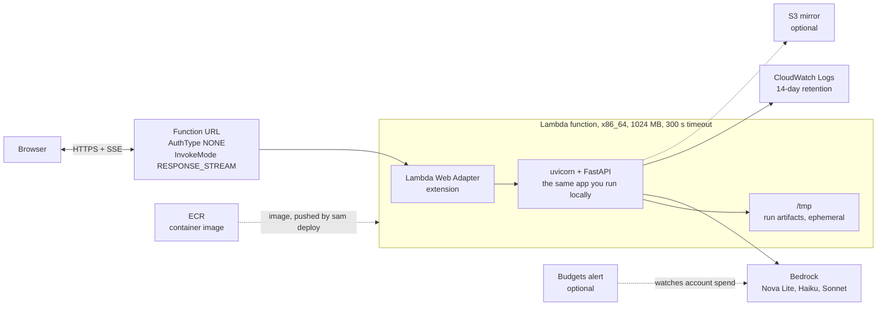
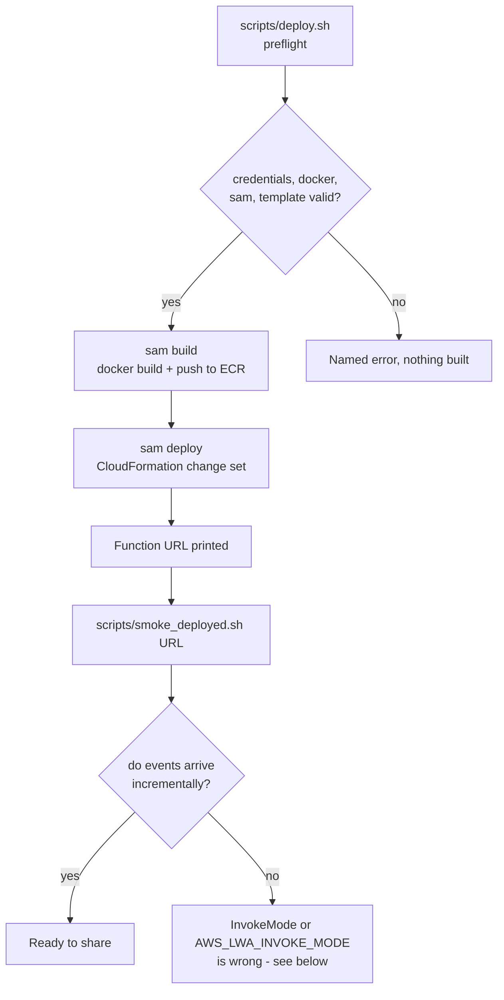

# Deploying to AWS

One command, once the prerequisites are in place:

```bash
BUDGET_EMAIL=you@example.com bash scripts/deploy.sh
```

It prints a URL that serves both the interface and the API. For what gets created and why,
read on. For the local development loop instead, see [QUICKSTART.md](QUICKSTART.md).

## What this deploys



Five resources, four of them free at rest: the function, its function URL, an ECR repository
SAM manages for you, a log group with retention set, and optionally a monthly budget alert.
There is no API Gateway (a function URL is enough and cheaper), no load balancer, no database,
and nothing that costs money while idle.

## Why Lambda and not a container service

Traffic here is a few reviewers opening a link. Fargate or App Runner would bill continuously
for a service that is idle almost all the time, and neither buys anything this workload needs:
a run is a dozen sequential Bedrock calls, tens of seconds, mostly spent waiting. Lambda's
cold start costs a second or two on first visit and nothing at all thereafter.

The two constraints this imposes are already handled in the code: the task root is read-only,
so every write goes through `config.output_dir()` which becomes `/tmp/schema_mapper` under
Lambda; and `/tmp` is empty on each cold start, so the committed artifact is baked into the
image and served from there when `/tmp` has nothing yet.

## Prerequisites

| Requirement | Check | Notes |
| --- | --- | --- |
| AWS credentials | `aws sts get-caller-identity` | Needs permission to create IAM roles, Lambda functions, ECR repositories, and log groups |
| Docker running | `docker info` | `sam build` builds the image locally |
| AWS SAM CLI | `sam --version` | Or `pip install aws-sam-cli` into a throwaway venv and pass `SAM=/path/to/sam` |
| Bedrock model access | `python scripts/check_bedrock.py` | Being able to *list* a model is not the same as being able to invoke it |

Deploy into a region where your Bedrock models are enabled. The defaults are `us.*`
cross-region inference profiles enabled in `us-east-1`, which is what `samconfig.toml` sets.
Lambda supplies `AWS_REGION` itself and it is reserved, so the Bedrock region *is* the deploy
region — there is no separate setting to get wrong.

## The deploy, step by step



Preflight fails loudly and early on purpose: every check in it maps to a failure that
otherwise surfaces minutes into a build, or as a deployed app that looks healthy and cannot
call Bedrock.

## Verify before sharing the link

```bash
bash scripts/smoke_deployed.sh https://xxxx.lambda-url.us-east-1.on.aws/
```

It checks health, that the page opens on the committed artifact rather than an empty graph,
that the free endpoints work, and that a full offline run completes. The check that matters
most is the last one: it records **when** each progress event arrives. Everything else passes
identically in buffered mode, where Lambda holds the entire event stream and delivers it at
the end — the app looks fine while the live graph sits empty for the whole run.

Streaming requires two settings that must agree, one on each side:

| Setting | Where | Value |
| --- | --- | --- |
| `InvokeMode` | `template.yaml`, `FunctionUrlConfig` | `RESPONSE_STREAM` |
| `AWS_LWA_INVOKE_MODE` | `Dockerfile` | `response_stream` |

If they disagree, the browser receives a payload in a format it cannot parse. If both are left
at the default, progress arrives in one burst at the end. Response compression is also
incompatible with streaming, which is why `AWS_LWA_ENABLE_COMPRESSION` is never set.

## Testing the image without deploying

The image runs unchanged on a laptop, because the adapter is a Lambda extension that simply
does not run anywhere else:

```bash
docker build -t schema-field-mapper .
docker run --rm -p 8081:8080 schema-field-mapper
bash scripts/smoke_deployed.sh http://127.0.0.1:8081
```

This is the fastest way to catch a packaging mistake — a missing asset, a wrong `PYTHONPATH`,
cassettes left out so offline replay disappears. The image is about 310 MB and the health
endpoint reports `cassette_count`, so a build that dropped them is visible immediately.

What this cannot test is the streaming path, since the adapter is inactive locally. That check
only means something against the deployed URL.

## Access and spend

The function URL is deployed with `AuthType: NONE`: anyone with the link can use it, including
starting a live run that calls Bedrock. That is a deliberate choice for a small group of
reviewers, and these are the guards that make it reasonable:

| Guard | Where | Default |
| --- | --- | --- |
| Reserved concurrency | `ReservedConcurrency` | 5 simultaneous runs, hard ceiling |
| Per-run token ceiling | `MaxTokensPerRun` | 120,000 tokens, checked before each call |
| Budget alert | `BudgetEmail` | Email at 80% actual and 100% forecast |
| Log retention | `LogRetentionDays` | 14 days, so logs cannot accumulate cost forever |
| Free offline replay | Cassettes in the image | A visitor can watch a full run without spending anything |

A live run of the bundled schemas costs about **$0.04**. Lambda and ECR for a demo of this size
round to cents per month. The realistic worst case is someone repeatedly starting live runs:
five concurrent runs at four cents each is not alarming, but the budget alert is the thing that
tells you if it becomes a pattern.

To lock it down instead, set `ACCESS_TOKEN=...` when deploying. Be aware of the consequence:
`X-Access-Token` is enforced on `POST /api/run`, and the browser UI does not send it, so the
deployed page becomes read-only and only `curl` can start runs.

## Operating it

| Task | Command |
| --- | --- |
| Tail logs | `aws logs tail /aws/lambda/schema-field-mapper-app --follow` |
| Redeploy after a change | `bash scripts/deploy.sh` |
| Read the URL again | `aws cloudformation describe-stacks --stack-name schema-field-mapper --query "Stacks[0].Outputs"` |
| Delete everything | `sam delete --stack-name schema-field-mapper` |

Run history (`GET /api/runs`) is a bounded in-memory map inside one execution environment. With
concurrency above 1, two visitors may be served by different environments and see different
histories, and a recycled environment starts empty. This is deliberate — the artifact is the
deliverable and is downloadable from the run itself — but set `ArtifactBucket` to an existing
bucket if you want run artifacts to outlive the container.

## When something is wrong

| Symptom | Likely cause |
| --- | --- |
| Page loads, graph is empty | The committed artifact is missing from the image; check the `COPY outputs/...` line |
| `offline_available: false` in health | Cassettes were not copied into the image |
| Every live run fails with an access error | Bedrock model access is not enabled in the deploy region; run `scripts/check_bedrock.py` |
| Progress appears all at once at the end | Buffered invoke mode — the two settings in the table above disagree or are unset |
| A run stops partway with `BudgetExceeded` | The per-run token ceiling was hit; raise `MaxTokensPerRun` |
| `CassetteMissing` on a custom schema | Expected: offline replay only reproduces recorded runs. Untick offline for a live run |
| 502 from the URL | The app failed to start; check the log group for the traceback |
