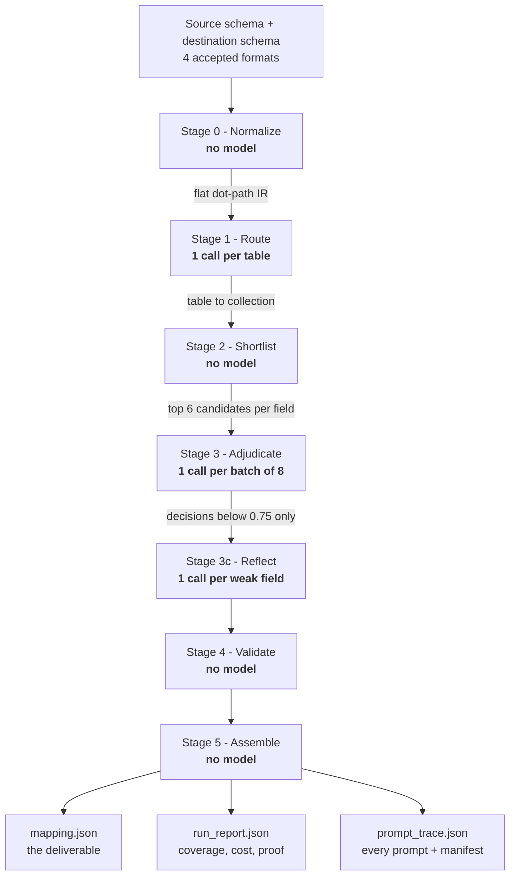
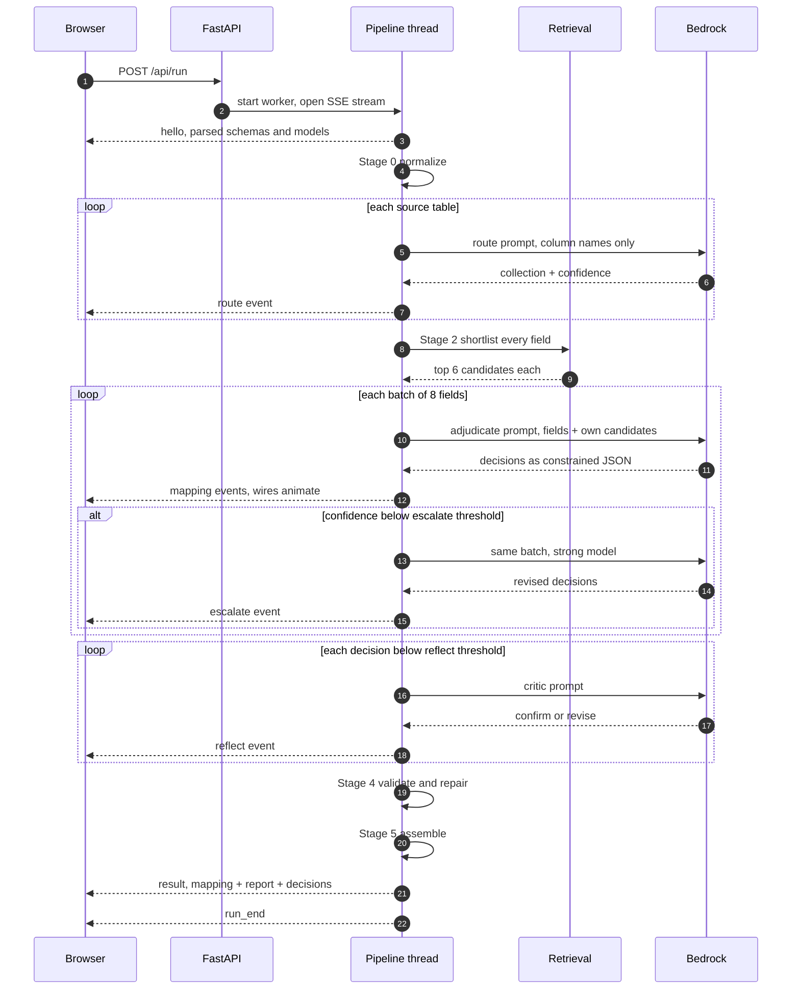
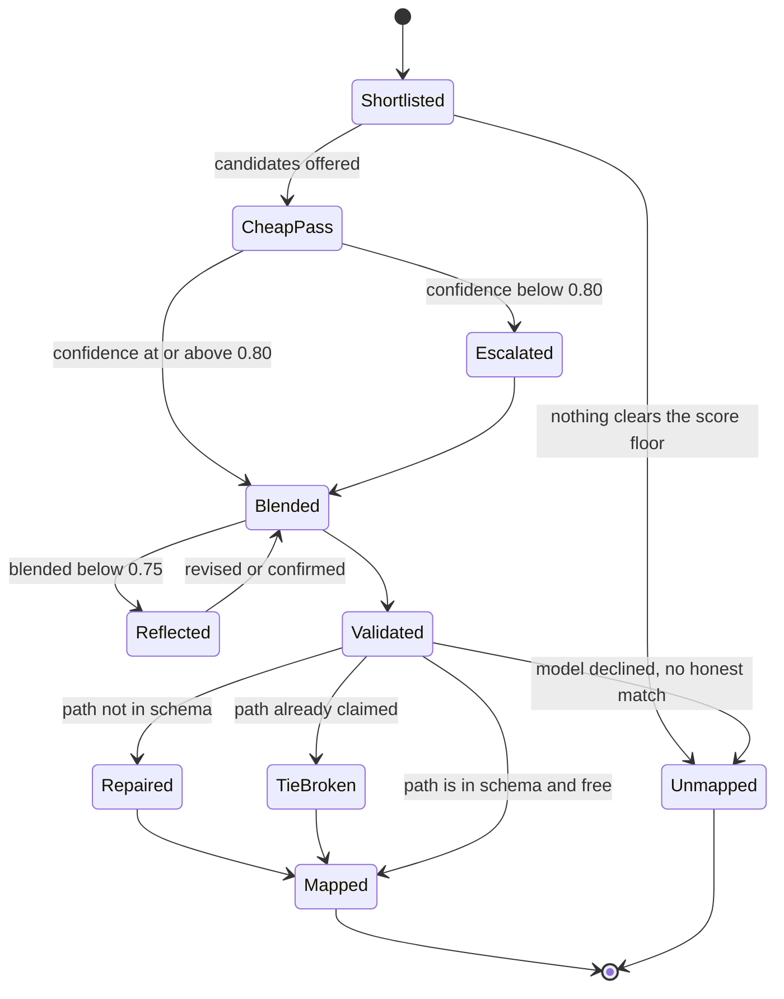
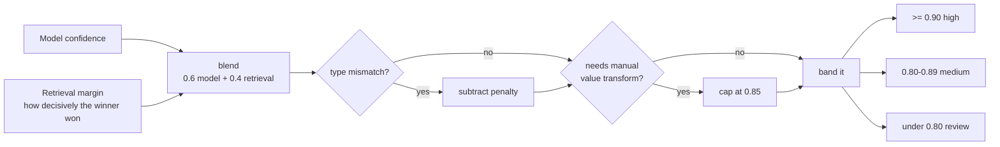
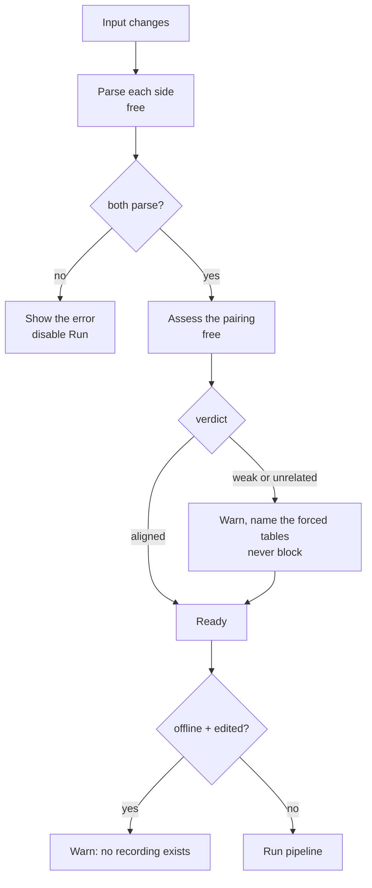
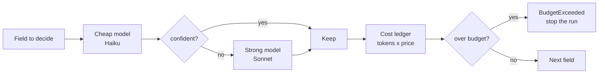
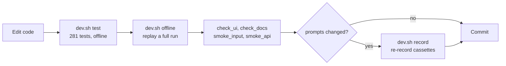

# Pipeline and workflows

What happens between "here are two schemas" and "here is a mapping you can review." For the
component structure see [ARCHITECTURE.md](ARCHITECTURE.md).

## The six stages

| Stage | Sees | Produces | Model |
| --- | --- | --- | --- |
| 0 Normalize | Raw schema text | Flat `SourceField` and `DestField` lists, dot paths | — |
| 1 Route | One table's **column names**, all collection names | Table to collection pairing + confidence | Cheap |
| 2 Shortlist | One field, one collection's paths | Top 6 candidates with score components | — |
| 3 Adjudicate | 8 fields, each with its own 6 candidates | Chosen path, transform, confidence, reasoning, notes | Cheap, escalating |
| 3c Reflect | One weak decision and its shortlist | Revised decision or the same one confirmed | Strong |
| 4 Validate | Everything | Repairs, tie-breaks, forced unmapped, diagnostics | — |
| 5 Assemble | Decisions | The three artifacts | — |

Stage 1 seeing **names without types** is deliberate. Routing is a three-way choice that
needs vocabulary, not data types, and withholding types keeps the prompt small enough that
the constraint proof stays comfortably clear of any threshold.

## A run, end to end

The pipeline is synchronous, so it runs on a worker thread and publishes events through a
queue while the request handler forwards them. That keeps the pipeline free of any web
concerns — the CLI runs the identical code with an event callback that prints instead.

## How one field is decided

Every transition is recorded on the `Decision`, which is what the **Decision** tab reads. A
field that was escalated and then revised by reflection shows all three passes with their
individual answers, so a disagreement between models is visible rather than averaged away.

## Confidence

A model's self-reported confidence is nearly useless alone — it reports 0.99 for almost
everything, including the wrong answers. Blending it with the retrieval margin fixes the
common failure: a field whose top two candidates scored 0.44 and 0.43 is genuinely ambiguous
no matter how sure the model sounds, and it lands in the review band where a human will look.

## Pre-run checks, in cost order

Everything that can be checked for free is checked before anything is spent. The ordering is
the point: a format error, a mismatched pair, and a missing recording are all knowable without
a single model call, and each one used to be discovered only *after* paying for a run.

## Cost control

Four mechanisms, in order of how much they save: the cascade (only weak fields reach the
strong model), response caching within a run, batching eight fields per call, and routing on
names alone. A full live run of the assignment schemas costs about **$0.04**; the library test
pair cost **$0.065** cold and **$0.02** when re-run with cache hits.

## Development workflow

The loop that matters: **change a prompt and the cassettes go stale**, because replay is keyed
by request hash. An offline run then fails with `CassetteMissing`, which is the intended
signal to re-record against live Bedrock rather than a bug.

## Evaluation

Each of these fails loudly rather than printing a number to interpret:

| Command | Asserts |
| --- | --- |
| `bash scripts/dev.sh test` | Full suite, no AWS needed |
| `python scripts/eval_retrieval.py` | Stage 2 shortlist contains the oracle's answer |
| `python scripts/eval_pairing.py` | Every true schema pair outscores every crossed pair |
| `bash scripts/smoke_input.sh` | Samples parse, bad input is refused, mismatches are flagged |
| `bash scripts/smoke_api.sh` | Every endpoint plus a full SSE run |
| `bash scripts/check_docs.sh` | Documented examples actually run; links resolve |
| `bash scripts/check_ui.sh` | UI components and endpoints are wired |
| `python scripts/show_mapping.py <artifact>` | Reads a mapping as a table for eyeballing |
