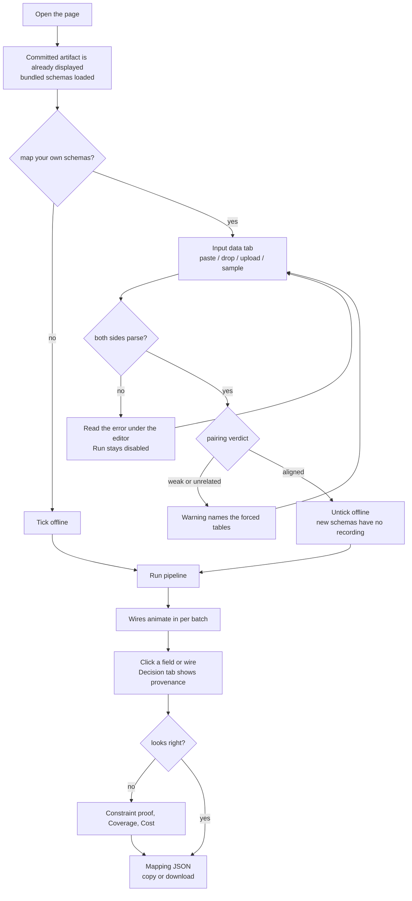

# Using the interface

```bash
bash scripts/dev.sh api          # http://localhost:8000
```

The bundled `legacy_hrm` and `people_platform` schemas load automatically and the committed
artifact is displayed, so the page is useful before you run anything. The same content as
this page is available in-app under the **Guide** tab.

## The path through the interface



## Layout

| Region | What it is for |
| --- | --- |
| Header | Title, byline, what the tool does, run status badges, links to the API docs and Guide |
| Pipeline strip | One card per stage — which three call a model, what the other three do in code — lit stage by stage while a run streams |
| Input chip (top right) | What the next run will map — `database → database`, counts, `bundled` or `edited`. Click to open the input panel |
| Model row | Router, mapper, and cheap-pass model per role |
| Toggles | `cascade`, `reflect`, `offline`, and **Run pipeline** |
| Meter strip | Coverage, mean confidence, cost, LLM calls, largest prompt, both-schemas count, unmapped, duration |
| Left column | Source columns of the active table, each with a confidence dot |
| Centre canvas | One wire per decision, coloured by confidence |
| Right column | Destination leaf paths, ordered to follow the source so wires stay near-parallel |
| Table tabs | `emp_master → employees` and the other pairings |
| Bottom drawer | Guide, Input data, Decision, Constraint proof, Coverage & quality, Cost, Timeline, Mapping JSON |

### The pipeline strip

Running the full width of the header, under the title and the controls, is one card per
stage. It answers "what is this thing actually doing" without opening the Guide, and it is
where the explanation lives instead of in a paragraph beside the title:

| Card | Calls a model | What happens |
| --- | --- | --- |
| `0` Normalize | no | Flatten nested paths to dot notation, expand legacy abbreviations |
| `1` Route | **yes** | One call per table, seeing column names only, picks its collection |
| `2` Retrieve | no | Retrieval-augmented shortlist: scored candidate paths per column |
| `3` Adjudicate | **yes** | The model cascade judges only that shortlist, never both schemas |
| `3c` Reflect | **yes** | An evaluator-optimizer critic re-checks the least confident calls |
| `4-5` Verify | no | Invented-path guard, collisions, coverage, then assembly |

The `LLM` or `code` tag on each card is the honest answer to how much of this is a model:
three of the six stages, and each of those three sees a deliberately narrow slice of the
problem. Same six stages as [PIPELINE.md](PIPELINE.md), same ids the backend streams.

While a run is in flight the strip is also the position indicator: the current stage is
outlined in blue and pulses, finished stages turn green. The wires tell you *how much* is
done, the strip tells you *what* is being done — useful when a live run pauses on a stage and
you want to know whether it is routing, adjudicating, or already past the model calls.

## A first run

1. Tick **offline** to replay recorded exchanges — no AWS account, no spend, and the result
   matches the committed artifact.
2. Press **Run pipeline**. Wires animate in as each batch resolves; the log under
   **Timeline** narrates every stage.
3. Click any source column, destination path, or wire. The **Decision** tab shows that
   field's full provenance.
4. Take the artifact from **Mapping JSON** — copy, or download the exact file.

For a live Bedrock run, untick **offline**. Cost appears in the meter strip as it accrues.

## Reading the graph

Wire and dot colour encode the **blended** confidence, not the model's self-report:

| Band | Meaning | What to do |
| --- | --- | --- |
| Green, ≥ 0.90 | High | Spot-check |
| Amber, 0.80–0.89 | Medium | Read the reasoning |
| Red, < 0.80 | Review | Look at the candidate shortlist yourself |
| Hollow red dot | Unmapped | Check the declared justification |

Confidence is `0.6 × model confidence + 0.4 × normalized retrieval margin`, with a
type-mismatch penalty and a 0.85 cap when a required value transform cannot be expressed as
a rule. A field the model is sure about that only barely beat its runner-up lands in the
review band deliberately — that is exactly where a human should look.

Selecting a wire also labels it with its type transform.

## Giving it your own schemas

Open **Input data** (or click the input chip). Each side accepts four things:

- **Paste** into the editor.
- **Drag and drop** a file onto the box.
- **Upload file** — `.json`, `.sql`, or `.txt`, up to 200,000 characters.
- **Load sample…** — the bundled schemas plus `tiny_crm`, a small unrelated pair for
  checking that nothing is hardcoded to the HR schemas.

The format is detected from the content, so MySQL DDL, MySQL schema JSON, MongoDB schema
JSON, and `mongoexport` sample documents all work. Full details and examples:
[INPUT_FORMATS.md](INPUT_FORMATS.md).

As you type, the line under each editor reports what was understood —
`✓ MySQL CREATE TABLE · legacy_hrm · 3 tables · 34 columns` — or the exact parse error.
**Run pipeline** is disabled while the input does not parse, so a bad paste cannot waste a
paid run. **Reset to bundled schemas** restores the originals.

### What "upload" actually does

Nothing is uploaded in the usual sense. The browser reads the file locally with `FileReader`
and drops its **text** into the editor; the file itself never leaves your machine and the
server never writes it to disk. What travels is the text, in the body of `POST /api/parse`
while you type and `POST /api/run` when you press the button. So there is no upload step to
wait for, no stored copy to clean up, and editing the box after loading a file is the same
thing as having pasted it.

### Do you need both sides?

No. Each side falls back to the bundled schema independently, and the validation line tells
you which you are getting — `bundled default` or `pasted`. Supplying only a source maps your
tables onto `people_platform`, which is occasionally what you want and usually not. **For a
meaningful result, load both halves of one pair**, because mapping a library source onto an
HR destination correctly produces mostly unmapped fields.

### If the two files are not a pair

Both halves can parse perfectly and still not belong together. Nothing errors in that case,
which is the problem: routing has to choose *some* collection and shortlisting has to offer
*some* candidates, so pairing a library source with the HR destination produces
`bk_master → employees` and a confident-looking mess.

So there is a third check beside the two parse checks: a **pairing assessment**, computed
deterministically with no model call, shown in the input panel and beside the run button.

| Verdict | Meaning | What the UI does |
| --- | --- | --- |
| `aligned` | Every table has a clearly matching collection | Green note, no warning |
| `weak` | Some tables match, at least one is being forced | Amber warning naming the forced tables |
| `unrelated` | No table has a real counterpart | Red warning |

It names the specific table that has nowhere to go — for the library-against-HR case,
`1 of 3 source tables has no clearly matching collection, so the closest available is forced
(bk_master → departments)`. It also lists the likely routing per table with an affinity
score, which is a free preview of what Stage 1 will decide.

Two deliberate design choices here:

- **It warns, it never blocks.** The signal is name and comment vocabulary, and the margin
  between a real pair (0.48–0.61 in calibration) and a crossed one (0.28–0.43) is real but
  narrow. Blocking on a heuristic that tight would eventually refuse a legitimate schema.
- **It does not flag pairings that are genuinely fine.** In the library-against-HR case
  `brnch → locations` is *not* flagged, because both really are addresses and it scores 0.53
  on its own merits. Warning about it would train you to ignore the warnings.

The same assessment is written into `run_report.json` under `pairing`, so an artifact
produced from a mismatched pair carries the caveat with it rather than looking merely
low-confidence for no stated reason.

Calibration lives in `scripts/eval_pairing.py`, which scores every source against every
destination and fails if any true pair scores below any crossed pair.

### After loading: what to press, and how to tell it worked

1. Confirm both validation lines are green and read the counts back. If a line is red,
   nothing else will work; fix it there.
2. The header chip should now read your two database names and `edited`. That is the
   pre-flight check: it is what the next run will map.
3. **Untick offline.** Replay is keyed by request hash, so a schema pair with no recording
   has nothing to replay — see below.
4. Press **Run pipeline** and watch the meter strip.

It worked if all of the following hold, and each is visible without reading the JSON:

| Signal | Where | What good looks like |
| --- | --- | --- |
| Validation badge | Header | `valid`, not `invalid` |
| Coverage | Meter strip | Mapped + unmapped equals your source column count, with no remainder |
| Constraint proof | Drawer tab | Every check passing, both-schemas count zero |
| Confidence | Graph | Mostly green and amber; a wall of red means the pairing is wrong |
| Unmapped | Coverage & quality | Each unmapped field carries a stated reason |

A useful sanity check on a new schema: open a red wire and read its shortlist. If the right
destination path is not even in the candidate list, the problem is retrieval, not the model —
usually a column whose name and comment share no vocabulary with the destination.

### Your own schemas cannot run offline

Cassette replay matches a hash of each request, so an unrecorded schema has no recording.
With **offline** ticked and edited input, the run stops on the first stage with
`CassetteMissing: No cassette for stage 'route'` in the log rather than half-writing an
artifact — and the interface warns you next to the run button before you press it. To map
your own schemas you need live Bedrock credentials in `.env`; a run of this size costs a few
cents. Verify access first with `bash scripts/dev.sh bedrock`.

## The drawer tabs

**Decision** — for the selected field: the chosen path, type transform, confidence,
reasoning, notes, the candidate shortlist it beat with per-component scores, which model
pass decided it (cheap, escalated, or revised by reflection), any knowledge snippets cited,
and the transform executed against a real row.

**Constraint proof** — the assignment forbids passing both schemas in one prompt for a
finished mapping. This restates that rule as live pass/fail checks computed from the run's
own prompt manifests: the largest number of typed source fields in any one prompt, the most
destination paths, the most mappings any single response produced, and the count of prompts
containing both full schemas (which must be zero). Every prompt in the run is listed with
its manifest.

**Coverage & quality** — every source field is either mapped or explicitly declared
unmapped; the same for destination paths. Also the confidence histogram, escalation rate,
and any repairs, tie-breaks, or corrected notes.

Unmapped is a result, not a failure: `emp_master.dob` has no counterpart in `people_platform`,
so declaring it unmapped is the correct answer and the oracle in `tests/` expects exactly that.
Every declined field states why, in the model's own words, under **Unmapped, with reasons**
here and in the Reasoning row of its **Decision** tab. The artifact keeps
`unmapped_source_fields` as a plain list of names because the assignment's contract asks for
that shape; the sentences live in `run_report.json` under
`coverage.unmapped_source_explanations`.

**Cost** — per-call token counts and USD by stage and model, cost per mapped field, cache
hits, and what the run would have cost on other models. An offline run reports the
*recorded* cost marked as not billed, rather than a misleading zero.

**Timeline** — stage durations plus the full event log.

**Mapping JSON** — the deliverable, with copy and download.

## Why there are three model choices

A run is not one kind of model call repeated. It is three different jobs with different
difficulty, different volume, and therefore different economics, so the header exposes one
model per **role** rather than a single "which model" dropdown. One dropdown would force you
to either pay strong-model prices for name matching, or send the genuinely hard semantic calls
to a cheap model. Splitting the roles is what makes a full run cost about four cents.

| Selector | Which calls it makes | Why it is its own choice | Default |
| --- | --- | --- | --- |
| **Router** | Stage 1, one call per source table. Also the short reasoning-rewrite repair in stage 4 | It picks a collection for a table from column *names* only — vocabulary matching over three candidates, not reasoning. Spending a strong model here buys nothing measurable | Nova Lite |
| **Cheap pass** | The first attempt at **every** field in stage 3, in batches of eight | This is the high-volume role: most columns (`f_name` → `fullName.firstName`) are decidable by a small model once retrieval has narrowed them to six candidates. It exists so the strong model is only spent where it is needed | Claude Haiku 4.5 |
| **Mapper** | Stage 3 escalations, the stage 3c reflection pass, and tie-breaks in stage 4. With **cascade** off, all of stage 3 | The strong model, reserved for the judgment calls: enum decoding, lossy type transforms, two candidates that both look plausible. Artifact quality tracks this one | Claude Sonnet 4.5 |

The handoff between the last two is the **cascade**: the cheap pass answers, and any field it
was less than `0.80` sure of is re-asked of the mapper. Those answers are then blended with
the retrieval margin, and anything still under `0.75` goes to the reflection critic — which
runs on the mapper model too. So the three selectors are not three alternatives; they are
three positions in one escalation chain, and `escalation rate` under **Coverage & quality**
tells you how much of the work actually reached the top of it.

### Choosing them

| If you want | Set |
| --- | --- |
| The sane default | Leave all three. About $0.04 for the 34-column assignment pair |
| To spend less | Router to Nova Micro and cheap pass to Nova Lite. Watch the escalation rate: past roughly a third, the cascade is paying twice per field and a better cheap model is cheaper overall |
| Maximum quality, cost no object | Mapper **and** cheap pass to Sonnet 4.5, or untick **cascade** to send every field straight to the mapper |
| To see what a model is worth | Run it, then read **Cost** — it prices the same run against every other model in the registry, so you can compare without paying twice |

Two behaviours worth knowing, because neither is obvious from the dropdowns:

- **Setting the cheap pass to the same model as the mapper turns the cascade off**, whatever
  the toggle says. The chain collapses to a single model, and nothing escalates because
  there is nowhere to escalate to.
- **The model ids are part of the replay key.** The 11 cassettes were recorded with the three
  defaults, so a changed selector while **offline** is ticked asks for a recording that does
  not exist. The same goes for unticking **cascade**, which sends stage 3 to a model
  combination that was never recorded. Rather than dying mid-stage on `CassetteMissing`, the
  hint beside **Run pipeline** names what is uncovered and offers **restore the recorded
  settings**. Unticking **reflect** offline is safe: skipping recorded calls is not the same as
  needing unrecorded ones. Model choices only mean something on a live run.

Whatever you pick is written into `run_report.json` under `models`, with labels, so an
artifact says which models produced it.

### The toggles beside them

| Control | Effect |
| --- | --- |
| **cascade** | Cheap model first, escalating only fields it was under `0.80` sure of. Roughly a third of the cost with no meaningful accuracy loss |
| **reflect** | A bounded critic pass over decisions whose *blended* confidence is under `0.75`. Touches a handful of fields, costs pennies |
| **offline** | Replay recordings instead of calling Bedrock. Free, and byte-identical to the recorded run |

## Testing over the API instead

Everything here is an HTTP endpoint, and Swagger UI at <http://localhost:8000/docs> will
run any of them from the browser. See [API.md](API.md).
