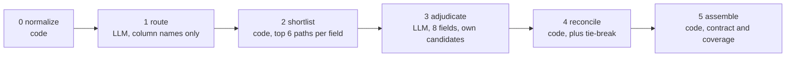

# Write-up: prompt structure and design decisions

Mapping `legacy_hrm` (MySQL, 34 columns across 3 tables) to `people_platform` (MongoDB, 40 paths
across 3 collections). Result: **33 of 34 source fields mapped**, one deliberate non-mapping
(`emp_master.dob`), 11 model calls, about $0.04 and 35 seconds per run. All prompt text is in one
file, [`src/schema_mapper/prompts.py`](../src/schema_mapper/prompts.py).

## The constraint shaped the architecture

I read "you cannot pass both schemas in a single prompt and receive a finished mapping" strictly:
no single call may have enough context to produce the answer. Six stages, four of them pure
Python, with the model used only where judgment is required.

Two things keep that honest. LLM-facing code physically cannot reach a whole schema: its only
access is a scoped tool surface ([`tools.py`](../src/schema_mapper/tools.py)) where
`get_source_fields()` raises if asked for more than one batch and `lookup_candidates()` returns
at most six paths for one named field. And every request is recorded, so
[`tests/test_constraint.py`](../tests/test_constraint.py) asserts against the text actually sent:
the worst-case prompt carried 8 of 34 typed fields, 22 of 40 destination paths, 1 of 3 tables,
and no call returned more than 8 of the 33 mappings.

Worth admitting: the largest prompt is 2,091 tokens against ~1,630 for both raw schemas
concatenated. Decomposition bounds *what each decision depends on*; it is not a token saving.

## How the prompts are structured

Four templates, each with a JSON tool schema for its output, so structure is enforced by
constrained decoding rather than by asking for JSON in prose.

| Stage | Sees | Returns |
| --- | --- | --- |
| Route | One table's column names and the collection names. No types | One collection, confidence, one sentence |
| Adjudicate | Up to 8 fields, each with its own <=6 candidate paths (type, comment, references), plus 3-5 retrieved convention snippets | One entry per field: path or null, confidence, one sentence, notes |
| Reflect | One low-confidence field, the same candidates, and the prior decision | Confirm or replace, plus a `changed` flag |
| Tie-break | One contested path and exactly the two competing columns | The winning column |

The adjudication system prompt is six numbered rules. Two of them do the real work: *never invent
a path, only listed candidates are valid* (backed by a code-level allowlist that can force a
mapping back to null), and *prefer null over a weak guess, a wrong mapping is more expensive than
an acknowledged gap* — which is why `dob` comes back null with a sentence explaining the refusal
rather than being forced into `employment.startDate`.

Three things are deliberately kept **out**:

- **Retrieval scores.** Showing them would anchor the model to the top-ranked candidate and make
  the blended confidence circular instead of two weakly-correlated signals.
- **`type_transform`.** Rendered deterministically from the real types, never requested, which
  makes an impossible pairing like "VARCHAR -> Number" unrepresentable rather than unlikely.
- **Other fields and other tables.** Each field sees only its own candidates.

## Design decisions

- **Deterministic where determinism is provably right.** The Stage 2 scorer (five explainable
  components: lexical overlap with abbreviation and synonym expansion, fuzzy, comment similarity,
  type compatibility, key role) reaches recall@6 of 100% *and* rank@1 of 100% here. So on these
  datasets the model's real contribution is the reasoning, the notes, the null decision, and
  robustness where lexical signal is weaker — not the pairing itself. Better to say that than to
  imply the LLM found what the code could not.
- **Confidence blends two signals**: 60% model self-report, 40% retrieval score, penalised for
  type mismatch and capped at 0.85 when a hand-written value transform is needed. Reflection
  triggers below 0.75 on the *blended* value, since a field the model is sure about that barely
  beat its runner-up is exactly what deserves review. Result: 13 high, 16 medium, 4 for review.
- **A cascade, not one model.** Nova Lite routes; Claude Haiku 4.5 answers every batch; only
  fields below 0.80 escalate to Sonnet 4.5. Escalation rate 5.9%, which is what keeps a run at
  four cents.
- **Retrieval yes, vector database no.** The shortlist is retrieval, and a small conventions pack
  supplies snippets the model can cite (it also powers synonym expansion — without it
  `dept_stat -> isActive` has zero lexical overlap). For 40 paths, a vector store would cost more
  per month than the pipeline costs to run, and recall is already perfect.
- **Bounded agentic patterns**: orchestrator-worker plus an evaluator-optimizer critic over a
  scoped tool surface, and no free-roaming agent — a self-directed loop would dissolve the very
  boundary the constraint requires.
- **Validation is deterministic and adversarial to my own output**: contract shape, every path
  checked against the real schema, coverage accounting, and an explanation for every unmapped
  field on both sides. The 7 untargeted destination paths are all denormalized copies such as
  `department.name` that a migration fills by joining — an explanation, not a gap.
- **Reproducibility.** Every Bedrock call is recorded, so the pipeline replays offline byte for
  byte with no credentials and no spend, which is what makes the 286 tests runnable by a reviewer
  without an AWS account.

## Limits

Perfect retrieval means this schema pair is comparatively easy, so it does not prove the design on
harder input. The pre-run check that two schemas belong together separates true from crossed pairs
by only 0.049, so it warns and never blocks. Embeddings are wired but off and unverified.

Detail lives in [PIPELINE.md](PIPELINE.md) (stages, decision states, cost control) and
[ARCHITECTURE.md](ARCHITECTURE.md) (components, data model, deployment).
