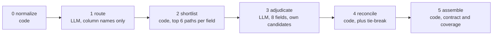

# Schema Field Mapper: Prompt Design and Design Decisions

Prepared by Raviteja Ainampudi. Scope: mapping `legacy_hrm` (MySQL, 34 columns, three tables) to
`people_platform` (MongoDB, 40 paths, three collections).

## 1. Summary

The pipeline mapped 33 of the 34 source columns and declined one, `emp_master.dob`, on the grounds
that no destination path is a genuine semantic match. A run uses 11 model calls, costs about $0.04
and takes about 35 seconds. Mean confidence is 0.865 (13 high, 16 medium, 4 flagged for review). All
prompt text is held in one module, [`src/schema_mapper/prompts.py`](../src/schema_mapper/prompts.py).

## 2. Approach

The assignment prohibits passing both schemas to a model in one prompt and receiving a finished
mapping. This was interpreted strictly: no single call should hold enough context to produce the
answer. The work is divided into six stages, four of them deterministic Python, with the model
reserved for decisions requiring judgement.

Two controls make that boundary verifiable rather than declared. Model-facing code has no route to a
complete schema, its only access being a scoped tool surface
([`tools.py`](../src/schema_mapper/tools.py)) where a request for more than one batch raises an
error and candidate lookup returns at most six paths for one named field. Every request is recorded,
and [`tests/test_constraint.py`](../tests/test_constraint.py) asserts against the text actually
sent: the largest prompt carried 8 of 34 typed fields, 22 of 40 destination paths and one of three
tables, and no response returned more than 8 of the 33 mappings. Decomposition constrains what each
decision depends upon rather than reducing token volume; the largest prompt is 2,091 input tokens
against roughly 1,630 for both schemas concatenated.

## 3. Prompt design

Four templates are used, each paired with a JSON tool schema so that response structure is enforced
by constrained decoding rather than requested in prose.

| Stage | Input provided | Output required |
| --- | --- | --- |
| Route | One table's column names and the candidate collection names, without types | One collection, a confidence, one sentence |
| Adjudicate | Up to 8 fields, each with its own six candidate paths including type, comment and references, plus three to five convention snippets | Per field: a path or null, confidence, one sentence, transform notes |
| Reflect | One low-confidence field, the same candidates, and the previous decision | Confirmation or replacement, with a change flag |
| Tie-break | One contested path and the two competing columns | The column that retains the path |

Two of the six adjudication rules govern quality. Paths may not be invented and only listed
candidates are valid, enforced additionally by an allowlist in code. Null is preferred to a weak
guess, since an incorrect mapping costs more to unwind than an acknowledged gap, which is why `dob`
is reported as unmapped with a justification rather than assigned to `employment.startDate`.

Three categories of information are withheld by design. Retrieval scores are not shown, as they
would anchor the model to the highest-ranked candidate and make the blended confidence
self-confirming. The `type_transform` value is derived in code from the actual types and never
requested, so an inconsistent pairing such as "VARCHAR to Number" cannot be expressed. No field sees
another field's candidates, and no prompt spans more than one table.

## 4. Design decisions

Deterministic logic is used wherever it can be shown correct. The Stage 2 scorer combines lexical
overlap with abbreviation and synonym expansion, fuzzy similarity, comment similarity, type
compatibility and key role; on this pair it recalls the correct path within the top six in every case
and ranks it first. The model's contribution on these datasets is therefore the reasoning, the
transform notes and the null decision rather than the pairing itself.

Confidence combines two weakly correlated signals, weighted 60 per cent to the model's own assessment
and 40 per cent to the retrieval score, penalised for type mismatch and capped at 0.85 where a manual
value transform is required. Reflection is triggered below 0.75 on the blended value, so a confident
answer that only narrowly beat its alternative is still reviewed.

Cost is managed by cascade: Nova Lite routes, Claude Haiku 4.5 takes the first pass, and only fields
below 0.80 escalate to Sonnet 4.5, an escalation rate of 5.9 per cent. Retrieval is used but no
vector database was introduced, since for 40 destination paths a managed store would cost more per
month than the pipeline costs to operate and shortlist recall is already complete. Agentic patterns
are bounded to an orchestrator with stage workers and an evaluator-optimizer review step over the
scoped tool surface; a self-directed agent would remove the boundary the constraint requires.

## 5. Validation

Deterministic validation runs before any artifact is written, covering the output contract, the
existence of every destination path in the real schema, coverage reconciliation on both sides and an
explanation for each unmapped field. The seven destination paths that receive no mapping are all
denormalized copies, such as `department.name`, that a migration populates by join. Every model call
is recorded, so the pipeline replays offline and the suite of 286 tests runs without an AWS account.

## 6. Credentials and access

Local development and the delivery of this exercise load configuration and credentials from a `.env`
file excluded from version control; no keys appear in code, logs or documentation. The deployed
function uses no static credentials, assuming instead an IAM execution role limited to Bedrock model
invocation, with optional write access to a single artifact prefix. For production the access model
would be tightened further: per-service roles scoped and reviewed against least privilege,
configuration held in Secrets Manager or SSM Parameter Store rather than in a file, and no long-lived
access keys issued to the application.

## 7. Limitations

Retrieval performance on this pair is perfect, which indicates a comparatively straightforward
mapping problem and does not demonstrate the design on harder input. The pre-run check that two
schemas belong to the same domain separates matched from mismatched pairs by only 0.049, so it warns
rather than blocks. Embedding support is implemented but disabled and not access-verified.

Further detail is in [PIPELINE.md](PIPELINE.md) for the stages and
[ARCHITECTURE.md](ARCHITECTURE.md) for components and deployment.
