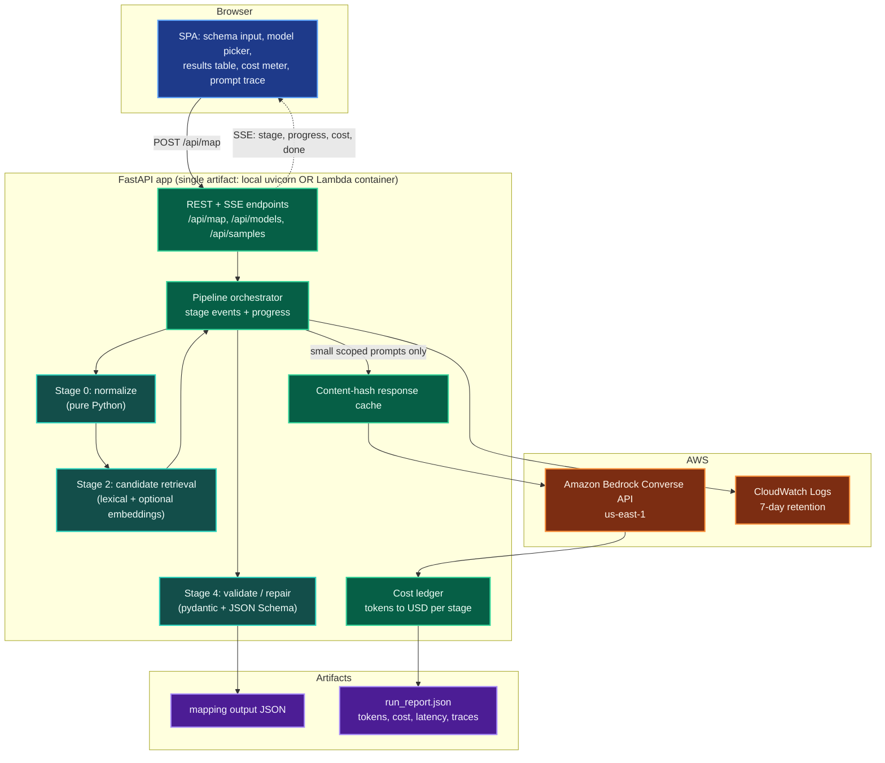
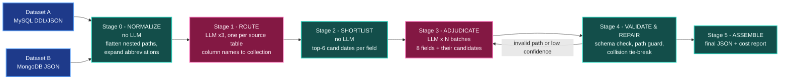
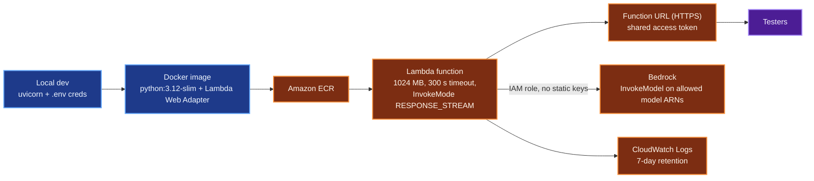

# Schema Field Mapper - Design & Delivery Plan

**Assignment:** map every field of a legacy MySQL HR schema (`legacy_hrm`) to its semantic equivalent in a modern MongoDB schema (`people_platform`), emitting one JSON document with per-field `source_field`, `destination_field` (dot notation), `type_transform`, `confidence`, `reasoning`, `notes`.

**Hard constraint from the assignment:** *you cannot pass both schemas to an LLM in a single prompt and receive a finished mapping.* Every design decision below flows from that.

**Stack decisions (confirmed):**

- LLM: **Amazon Bedrock** (region `us-east-1`, confirmed available), Converse API for a single code path across model families.
- Backend: **FastAPI** (Python 3.12) with Server-Sent Events for live progress.
- Frontend: single-page app served by the same FastAPI app (React 18 + Tailwind via CDN, no build step).
- Deployment: **AWS Lambda container image + Function URL** with response streaming (scales to zero).
- Model policy: **quality first** - default to a strong Claude model for the reasoning stage, cheap Nova models for mechanical stages, full model switching and live cost display in the UI.

---

## 1. Why the pipeline is decomposed (the constraint)

A naive solution pastes both schemas into one prompt. That is forbidden, and it is also genuinely worse: it invites hallucinated destination paths, gives no confidence calibration, and produces one giant blob you cannot validate or retry field-by-field.

Instead the work is decomposed so that **no single prompt contains both full schemas, and no single call produces the finished mapping**. Stated precisely, because this is the load-bearing claim: any semantic matcher must see fragments of both sides somewhere, so each prompt carries a small, bounded slice - never the whole of either schema, and never enough to answer the whole problem in one shot:

- Stage 1 runs **once per source table**, and each call sees only *that one table's column-name list* plus the three collection names (no types, no comments, no nesting). It returns a pairing, not mappings. Routing three tables is lexically trivial, so this could be pure code; it stays an LLM call because it is where the assignment's table-level `confidence` and `reasoning` legitimately come from. Splitting it per table costs a fraction of a cent and removes the only prompt in the run that would otherwise carry every column name from one side and every collection name from the other.
- Stage 3 sees, per call, *one batch of ~8 source fields from one table* plus, for each of those fields, only its *top-6 pre-shortlisted destination paths* - at most 48 destination paths against 74 total fields, and typically far fewer. Batches are **stateless**: each call is built from scratch, with no accumulated conversation history, so context cannot grow toward "both schemas" across the run.
- Stage 4 tie-breaks see only the two conflicting candidates.

The write-up states this formulation explicitly and quantifies it from the prompt trace (largest prompt of the run: fields, paths, tokens, versus the ~3,900-token both-schemas counterfactual), so a reviewer probing the constraint finds the argument already made.

Because the claim is load-bearing, it is also **machine-checked rather than asserted**. Every LLM request is recorded with a manifest - source-table count, source-field count, destination-path count, and the schema fingerprints it touched - and a test asserts that no single recorded request contains all 34 source fields, or all 40 destination paths, or produces more than one table's worth of mappings. A regression that quietly widens a prompt fails the suite instead of shipping.

The heavy lifting of "which destination paths are even plausible" is done **deterministically in code** (Stage 2), which is cheaper, faster, auditable, and makes hallucinated paths impossible to slip through.

## 2. System architecture

> Every diagram in this document appears twice: a plain-text flowchart that reads correctly anywhere, and the same graph as mermaid for a rich preview (`Ctrl+Shift+V`). The mermaid versions will also be exported to `project_plans/diagrams/*.png` and `*.svg` via `npx -y @mermaid-js/mermaid-cli` and embedded as images, so the colored form works in the raw editor, on GitHub, and in the write-up.

```text
                    +---------------------------------------------+
                    |               BROWSER (SPA)                 |
                    |  schema input | model picker | results grid |
                    |  cost meter   | prompt trace                |
                    +------+--------------------------+-----------+
                           | POST /api/map            ^ SSE events
                           v                          |
 +-------------------------+--------------------------+----------------------+
 |            FASTAPI APP   (local uvicorn OR Lambda container)              |
 |                                                                          |
 |  +---------------+     +----------------+     +---------------------+     |
 |  | [0] NORMALIZE |---->| [2] SHORTLIST  |---->| [4] VALIDATE/REPAIR |     |
 |  |    no LLM     |     |    no LLM      |     |      no LLM         |     |
 |  +-------+-------+     +-------+--------+     +----------+----------+     |
 |          |                     |                         |               |
 |          +----------+----------+                         |               |
 |                     v                                    |               |
 |          +------------------------+                      |               |
 |          |     ORCHESTRATOR       |                      |               |
 |          +----+--------------+----+                      |               |
 |               | prompt       ^ reply                      |              |
 |               v              |                            |              |
 |     +------------------+  +--+---------------+            |              |
 |     | RESPONSE CACHE   |  |   COST LEDGER    |            |              |
 |     +--------+---------+  +--------+---------+            |              |
 +--------------|--------------------|----------------------|---------------+
                | InvokeModel        ^ token usage          v
                v                    |            +----------------------+
     +--------------------------+     |            |  outputs/            |
     |     AMAZON BEDROCK       |-----+            |   mapping_*.json     |
     |  Converse API, us-east-1 |                  |   run_report.json    |
     +--------------------------+                  +----------------------+
```

Same graph in mermaid:



## 3. Pipeline stages

```text
      +--------------------+          +----------------------+
      | Dataset A: MySQL   |          | Dataset B: MongoDB   |
      |    legacy_hrm      |          |   people_platform    |
      +---------+----------+          +----------+-----------+
                |                                |
                +----------------+---------------+
                                 v
          +--------------------------------------------------+
          | [0] NORMALIZE                          no LLM    |
          | flatten nested paths to dot notation,            |
          | expand abbreviations, build valid path set       |
          +-----------------------+--------------------------+
                                  v
          +--------------------------------------------------+
          | [1] ROUTE                              LLM  x3   |
          | one call per source table:                       |
          | in : that table's column NAMES + collection names|
          | out: that table -> collection pairing            |
          +-----------------------+--------------------------+
                                  v
          +--------------------------------------------------+
          | [2] SHORTLIST                          no LLM    |
          | top-6 destination paths per source field,        |
          | scored inside its matched collection only        |
          +-----------------------+--------------------------+
                                  v
          +--------------------------------------------------+
          | [3] ADJUDICATE                         LLM  xN   |<--+
          | one call per ~8 source fields, each field        |   |
          | carrying only its own 6 candidates + null        |   | repair
          +-----------------------+--------------------------+   | retry
                                  v                              |
          +--------------------------------------------------+   |
          | [4] VALIDATE & REPAIR                  no LLM    +---+
          | JSON Schema, hallucinated-path guard,            |
          | collision tie-break, coverage assertion          |
          +-----------------------+--------------------------+
                                  v
          +--------------------------------------------------+
          | [5] ASSEMBLE                           no LLM    |
          +----------+----------------------------+----------+
                     v                            v
          +---------------------+     +-------------------------+
          |   mapping JSON      |     |    run_report.json      |
          | required contract   |     | tokens, USD, traces     |
          +---------------------+     +-------------------------+
```

Same graph in mermaid:



### Stage 0 - Normalize (deterministic)

Parse both schemas into an intermediate representation. MongoDB nesting is flattened to dot-notation paths up front, which is what makes `fullName.firstName` a first-class candidate rather than something the model has to invent.

```python
SourceField(table, name, sql_type, nullable, key, fk_target, comment)
DestField(collection, path, bson_type, comment, is_ref)
```

Also builds an abbreviation lexicon used by Stage 2 (`f_name` -> first name, `dob` -> date of birth, `cd` -> code, `nm` -> name, `dt` -> date, `ts` -> timestamp, `sal` -> salary, `mgr` -> manager, `lvl` -> level, `stat` -> status, `ctr` -> center, `tz` -> timezone).

### Stage 1 - Table routing (3 cheap LLM calls, one per source table)

Each prompt carries one source table's name and bare column-name list, plus the three collection names. It returns that table's pairing with a confidence and a one-sentence reasoning. Runs on **Nova Lite** - it is a 3-way matching problem, not a reasoning problem, and three calls at this size are still a rounding error on the run cost.

Two pairings that resolve to the same collection are a hard error rather than a silent overwrite, since the three source tables are known to be distinct entities.

### Stage 2 - Candidate shortlisting (deterministic, free)

For each source field, score **only destination paths inside its matched collection**:

- normalized token overlap after abbreviation expansion,
- trigram / Jaro-Winkler string similarity,
- type-compatibility bonus (`DATE`/`DATETIME` -> `ISODate`, `TINYINT(1)` -> `Boolean`, `CHAR(1)` -> `String` enum, `INT PK/FK` -> `ObjectId`),
- key-role bonus (PK -> `_id`, FK -> `*Id` ref paths),
- optional Bedrock **Titan Embeddings v2** cosine similarity (toggle in UI, ~$0.00002 per run).

Keeps top 6, and a candidate must clear a minimum score of 0.15 to be offered at all. This is the cost lever: prompts stay ~300-500 tokens instead of thousands.

It is also the accuracy ceiling, which is easy to miss. A field whose true destination is absent from its shortlist cannot be mapped correctly by any model at any price, so **shortlist recall is the metric that matters most** and is gated by a test (section 8.5) rather than inferred from output quality.

### Stage 3 - Field adjudication (LLM, batched)

One call per ~8 source fields of one table. Each field arrives with its own shortlist plus an explicit `null` option for "no good match". Output is forced through a **Converse tool-use JSON schema**, so the response is structurally valid by construction. Temperature 0. Runs on the user-selected mapper model (default Claude Sonnet class).

Returned `destination_field` is checked against the Stage 0 path set - a path that does not exist cannot survive.

**What `confidence` means.** The assignment requires the number but does not define it, and an LLM's self-reported certainty is poorly calibrated on its own, so the emitted value is a blend: `0.6 * model_confidence + 0.4 * normalized_retrieval_score`, where the retrieval score is the Stage 2 margin between the chosen candidate and the runner-up. A field the model is sure about *and* that won its shortlist decisively scores high; a field the model likes but that barely beat an alternative is pulled down into the review band, which is exactly where a human should look. Type incompatibility applies a fixed penalty, and a mapping requiring a value transform that cannot be expressed as a rule is capped at 0.85. The weights and the formula are stated in the write-up so the number is defensible rather than mysterious.

Table-level `confidence` is likewise deterministic, not a second guess: it is the mean of that table's field confidences, scaled by source-field coverage, so it cannot claim 0.97 for a table that mapped half its columns.

### Stage 4 - Validate & repair (deterministic + at most tiny LLM calls)

- pydantic + JSON Schema validation of every record against the required output contract,
- reasoning-format check: the assignment requires `reasoning` to be *one plain-English sentence*, so a sentence-count and length validator rejects multi-sentence or rambling reasoning and repairs it with a single cheap rewrite call,
- hallucinated-path guard, with a single-field retry for anything rejected,
- collision resolution when two source fields claim one destination path (highest confidence wins; if within 0.05, one tiny tie-break call containing just that pair),
- coverage assertion: every source field appears either in `field_mappings` or in `unmapped_source_fields`, and every destination path appears either as a target or in `unmapped_destination_fields`. This is what guarantees the assignment's "every field across all three source tables".

### Stage 5 - Assemble

Emits `outputs/mapping_legacy_hrm_to_people_platform.json` exactly in the required shape, plus `outputs/run_report.json` with per-stage model, token counts, latency, USD cost, cache hits, and the full text of every prompt sent with its manifest (the prompt trace doubles as evidence that the constraint was respected).

Two output conventions are pinned here because "matches this schema exactly" leaves them ambiguous:

- **Destination fields are leaf paths only.** `fullName` and `employment` are containers, not fields, so they never appear as a `destination_field` or in `unmapped_destination_fields`. That is what makes the destination side exactly 40 paths rather than 40 plus eight container names.
- **`type_transform` uses the ASCII arrow `->`**, matching the assignment's JSON example (`"INT -> ObjectId"`) rather than the `→` used in its prose bullets. The golden test pins this, since a Unicode arrow would be a gratuitous diff against the stated contract.

### Stage 3b - Model cascade (cost lever)

Every field first runs through a cheap model (Nova Lite or Haiku). Only fields returning confidence below a threshold (default 0.80) are re-adjudicated by the strong model. Typically 80-90% of fields resolve on the cheap pass, cutting run cost by roughly two thirds while keeping strong-model judgment where the decision is genuinely hard. Both passes are recorded, so the escalation rate is a reportable metric.

### Stage 3c - Evaluator-optimizer reflection

A bounded critic pass (one iteration, no loops) reviews only mappings still below 0.75 after the cascade. It sees just that field, its candidate set, and the first pass's reasoning, then confirms or revises. It touches a handful of fields per run, so the cost is negligible and it lifts the weakest decisions.

### Conventions knowledge pack (retrieval that earns its keep)

A small local corpus - HR domain abbreviations, ISO standards (4217 currency, 3166-1 country, IANA timezones), naming-convention rules (`snake_case` to `camelCase`, `*_cd` to `code`), canonical MySQL-to-BSON type mappings, and human-approved mappings accumulated from the UI. Three to five relevant snippets are retrieved per batch and injected alongside the candidates. This improves consistency, gives the model an authority to cite in `reasoning`, and closes a feedback loop: a mapping a user marks verified is stored and retrieved as a few-shot exemplar on later runs.

No vector database. The corpus and the schema itself are tiny, so retrieval is in-memory with lexical scoring plus Titan embeddings. Standing up OpenSearch Serverless for 74 fields would cost hundreds of dollars a month to index something that fits on a napkin.

## 3.5 AI architecture and agentic patterns

The patterns deliberately used, and the one deliberately rejected:

- **Prompt chaining with task decomposition** - the six-stage pipeline, which is what satisfies the assignment constraint.
- **Model routing by role** - cheap model for mechanical routing, strong model for semantic judgment.
- **Retrieval-augmented generation** - Stage 2 candidate shortlisting plus the conventions knowledge pack. Retrieve a scoped context, then generate.
- **Constrained decoding** - Converse tool-use JSON schemas, so output is structurally valid by construction.
- **Orchestrator-worker fan-out** - the orchestrator dispatches per-table, per-batch mapping workers and collects results.
- **Evaluator-optimizer reflection** - bounded critic pass on low-confidence fields.
- **Tool-scoped access as constraint enforcement** - the mapper calls `lookup_candidates(field_id)` rather than receiving pasted data, and no tool is capable of returning a whole schema. The constraint is enforced by code, and the prompt trace proves it.
- **Validators as code** - JSON Schema, destination-path allowlist, collision detection, coverage assertion. Guardrails live in Python, not in prompt wording.
- **Human-in-the-loop feedback as memory** - verified overrides become retrievable exemplars.
- **Determinism** - temperature 0 plus a content-hash response cache, so a rerun is reproducible and free. The cache is S3-backed in Lambda (a `/tmp` disk cache would not survive cold starts, silently breaking cache hits and resume-from-stage) and disk-backed locally behind the same interface.

Fixed thresholds shared by the pipeline, UI, and write-up: confidence bands at 0.90 and above (high), 0.80 to 0.89 (medium), below 0.80 (review); cascade escalation below 0.80; reflection below 0.75; collision tie-break when two confidences are within 0.05; candidate shortlist of 6 with a 0.15 minimum score, and no forced match when nothing qualifies.

**Rejected: an autonomous agent as the primary architecture.** The workflow is known and fixed, so there is nothing to discover; an agent loop adds latency, cost variance, and nondeterminism to a task that reviewers want reproducible; and an agent holding a schema-fetching tool could pull both schemas into its own context, which is exactly what the assignment forbids. Handing that decision to a model means the constraint can no longer be proven. Bedrock Agents as a managed service is skipped for the same reason - it obscures the exact prompt content the constraint proof depends on.

### Agent mode (experimental, built last)

To make that rejection a measurement rather than an assertion, a toggle runs the same schemas through a genuine tool-calling agent loop over the **identical scoped tool surface**: `list_tables()`, `get_source_fields(table)`, `lookup_candidates(field_id)`. Hard caps: 40 tool calls, a token budget, temperature 0, and the same output contract so the diff view works unchanged.

**Scoped tools alone do not make the agent compliant, and the plan previously overclaimed that they did.** A tool-calling loop carries every prior tool result forward in its context, so an agent that walks all three tables ends up holding both schemas in one context window while being asked for mappings - functionally the thing the assignment forbids, even though no individual tool ever returned a whole schema. Compliance therefore comes from **per-task context reset**: the agent is restarted with empty history for each bounded subtask (one table's routing, or one batch of fields), and the same prompt-manifest assertion that guards the pipeline is applied to agent turns. Agent mode is additionally kept out of the graded path - the committed output JSON always comes from the pipeline - so this experiment can never be what a reviewer evaluates the constraint against.

Expected finding is three to five times the tokens for similar or slightly worse consistency, which costs pennies to demonstrate. If the agent wins on specific fields, the write-up reports that and explains why. This is the first feature cut if time runs short.

## 4. Cost model

Live us-east-1 on-demand rates, per 1M tokens, held in a registry so the UI can price any run:

- Amazon Nova Micro - $0.035 in / $0.14 out
- Amazon Nova Lite - $0.06 in / $0.24 out
- Amazon Nova Pro - $0.80 in / $3.20 out
- Claude Haiku 4.5 - $1.00 in / $5.00 out
- Claude Sonnet 4.6 - $3.00 in / $15.00 out
- Titan Embeddings v2 - $0.02 in

A full 3-table run is roughly 12-18k input and 4-6k output tokens after shortlisting:

- Nova Lite router + Claude Sonnet mapper: **~$0.10-0.14 per run**
- Nova Lite router + Claude Haiku mapper: **~$0.03-0.05 per run**
- Cascade (Haiku first, Sonnet only below 0.80): **~$0.04-0.06 per run**, the default
- All Nova Lite: **~$0.002 per run**
- Agent mode, for comparison only: roughly 3-5x the equivalent pipeline run

Infrastructure is effectively free: Lambda at 1 GB for ~30 s per run stays inside the free tier for demo traffic, Function URLs cost nothing, ECR storage for a ~400 MB image is about **$0.04/month**, and CloudWatch logs are capped with 7-day retention. Persistence adds almost nothing measurable - S3 holds a few kilobytes of JSON per run, and DynamoDB on-demand at $1.25 per million writes means a thousand runs cost about **$0.00125**. Expect **under $1/month** all-in for a shared demo, dominated by whatever Bedrock tokens testers spend.

Guardrails: reserved concurrency of 2, a per-run token ceiling, an AWS Budgets alert at $5, and a shared access token on the Function URL so the demo link cannot be used to burn your Bedrock quota.

## 5. UI

Full design, including the complete data inventory, states, and testing: [docs/superpowers/specs/2026-08-11-schema-mapper-ui-design.md](../docs/superpowers/specs/2026-08-11-schema-mapper-ui-design.md).

The centerpiece is an **interactive mapping graph** rather than a data grid: source fields on the left, the destination schema as a collapsible tree on the right showing real nesting, and wires between them whose color and thickness encode confidence, dashed where a value transform is required. Because results stream over SSE, wires animate into place as Stage 3 batches return, so a reviewer watches the pipeline resolve field by field.

```text
 +--------------------------------------------------------------------------------+
 | Schema Field Mapper    [Run]   $0.11 | 14.2k/4.8k tok | constraint: 412 tok max|
 +-----------+--------------------------------------------------+-----------------+
 | INPUT     |          MAPPING GRAPH        [graph | grid]     | FIELD DETAIL    |
 | source    | emp_master            employees                  | rec_stat        |
 | 3 tbl     |  emp_cd    =========> employeeCode        0.99    |  CHAR(1)        |
 | 34 col    |  f_name    =====\                                 | -> employment   |
 |           |  l_name    ===\  \==> fullName                    |    .status 0.95 |
 | dest      |  dob        ==\ \===>   .firstName       0.98     |                 |
 | 3 coll    |  rec_stat  ~~~~\ \==>   .lastName        0.98     | candidates:     |
 | 40 path   |  is_remote  ==\ \===> employment          --      |  .status  0.91  |
 |           |                \ \==>   .status          0.95     |  .jobLevel 0.22 |
 | [sample]  |                 \===>   .isRemote        0.99     |  .isRemote 0.11 |
 |           |                                                   |                 |
 | MODELS    | thick/green = high conf   ~~ = value transform     | transform:      |
 | router    |                                                   |  A -> active    |
 | mapper    | STAGE RAIL  [0]-[1]-[2]-[3 3/5]-[4]-[5]           |  I -> inactive  |
 | tiebreak  |                                                   |  T -> terminated|
 | [agent?]  | ARENA: Sonnet vs Haiku -> 31/33 agree, 2 differ    | [verify][edit]  |
 +-----------+--------------------------------------------------+-----------------+
 | Prompt trace | Constraint proof | Cost | Transform playground | History | Diff  |
 +--------------------------------------------------------------------------------+
```

Signature features beyond the graph:

- **Candidate race view** - selecting a field shows its top-6 shortlist as competing ghost wires with lexical, embedding, type-compatibility, and key-role score breakdowns, and the model's pick highlighted.
- **Constraint meter** - live readout of the largest prompt in the run (fields, candidate paths, tokens) against the counterfactual token count of a both-schemas prompt.
- **Transform playground** - edit a sample source row and watch the target document render with transforms applied client-side, each output field annotated with the rule that produced it.
- **Model arena** - overlay runs from different models on one graph; agreements mute, disagreements glow, with confidence, latency, and cost deltas.
- **Agent mode toggle** - experimental pipeline-vs-agent comparison, per section 3.5.

A grid view stays available as a toggle for reading long reasoning text and exporting.

### Persistence

S3 holds full artifacts per run (mapping JSON, run report, prompt traces) and is written first. DynamoDB holds only a ~1 KB index item per run for the history list and arena comparisons, written after S3 succeeds; an indexed run whose artifacts are gone renders as expired. On-demand billing, a GSI for the recent-runs query (never `Scan`), 30-day TTL on both stores, and Streams, point-in-time recovery, and global tables left off.

## 6. Deployment

```text
   +----------------------+        +-----------------------------------+
   | Local dev            |        | Docker image                      |
   | uvicorn + .env creds |------->| python:3.12-slim +                |
   +----------------------+        | AWS Lambda Web Adapter            |
                                   +-----------------+-----------------+
                                                     | docker push
                                                     v
                                   +-----------------------------------+
                                   | Amazon ECR                        |
                                   +-----------------+-----------------+
                                                     | sam deploy
                                                     v
   +----------------------+        +-----------------------------------+
   | Testers (browser)    |<------>| Function URL (HTTPS)              |
   +----------------------+        | shared access token               |
                                   +-----------------+-----------------+
                                                     v
                                   +-----------------------------------+
                                   | AWS LAMBDA                        |
                                   | 1024 MB | 300 s | RESPONSE_STREAM |
                                   +------+---------------------+------+
                                          |                     |
                                          v                     v
                        +------------------------+   +------------------------+
                        | Amazon Bedrock         |   | CloudWatch Logs        |
                        | execution role only,   |   | 7-day retention        |
                        | allowed model ARNs     |   +------------------------+
                        +------------------------+
                                          |
                        +-----------------+-----------------+
                        v                                   v
              +--------------------+            +------------------------+
              | Amazon S3          |            | Amazon DynamoDB        |
              | run artifacts      |            | run index (on-demand)  |
              | 30-day lifecycle   |            | GSI + 30-day TTL       |
              +--------------------+            +------------------------+
```

Same graph in mermaid:



Lambda is the right fit here: the workload is bursty demo traffic, idle cost is zero, and the Lambda Web Adapter lets the identical FastAPI app run locally and in Lambda with SSE streaming intact. Deployment is a SAM template (`infra/template.yaml`) plus `sam deploy --guided`.

Prerequisites to install before deploying: AWS CLI (`winget install Amazon.AWSCLI`) and SAM CLI (`pip install aws-sam-cli`). Docker is already present.

**EC2 alternative** (documented, not default): same container on a `t4g.small` behind Caddy for TLS. Simpler to reason about and fine on free tier, but always-on and roughly $6-12/month afterwards, plus you own patching and TLS renewal.

## 7. Repository layout

```
.env.sample                      # documented placeholders, no secrets
requirements.txt
project_plans/schema_field_mapper_plan.md
project_plans/diagrams/          # architecture|pipeline|deployment .mmd + .png + .svg + render.ps1
data/schemas/legacy_hrm.mysql.json
data/schemas/people_platform.mongo.json
data/knowledge/conventions.json  # ISO standards, abbreviations, type map, approved exemplars
src/schema_mapper/
  config.py        # env, model registry + pricing, role defaults, cascade thresholds
  models.py        # pydantic contract for the output JSON
  normalize.py     # Stage 0
  candidates.py    # Stage 2
  knowledge.py     # conventions retrieval + verified-override exemplars
  prompts.py       # per-stage templates
  tools.py         # scoped tool surface: list_tables, get_source_fields, lookup_candidates
  bedrock.py       # Converse client, retries, usage capture, cache
  pipeline.py      # orchestrator, cascade, reflection, emits progress events
  agent.py         # experimental tool-calling agent loop over the same scoped tools
  validate.py      # Stage 4
  cost.py          # token -> USD ledger
  store.py         # S3 artifacts + DynamoDB run index
  cli.py           # headless run, same code path as the API
api/main.py        # FastAPI + SSE
api/static/index.html
tests/
  fixtures/expected_mapping.json    # the 33-pair oracle + justified unmapped lists
  fixtures/cassettes/               # recorded Bedrock exchanges; power --offline and the suite
  test_normalize.py, test_candidates.py   # incl. shortlist-recall gate
  test_validate.py, test_contract.py      # incl. golden output + exact header strings
  test_constraint.py                # prompt-manifest assertions
infra/Dockerfile, infra/template.yaml, infra/DEPLOY.md
outputs/           # generated mapping + run report
docs/WRITEUP.md    # required write-up
```

## 8. Secrets handling

`.env` stays gitignored (already covered by `.gitignore`) and is used for local dev only. In Lambda, Bedrock access comes from the execution role, not from keys. The current `.env` carries credentials from another project (Stripe, Google, proxy, OpenAI); since this repo will be shared with reviewers, it should be trimmed to the AWS-only values below - the user will refresh `.env` once `.env.sample` exists. A new `.env.sample` documents what is needed:

```
AWS_DEFAULT_REGION=us-east-1
AWS_ACCESS_KEY_ID=your-access-key-id          # local dev only
AWS_SECRET_ACCESS_KEY=your-secret-access-key  # local dev only
BEDROCK_MAPPER_MODEL=us.anthropic.claude-sonnet-4-6-v1:0
BEDROCK_ROUTER_MODEL=us.amazon.nova-lite-v1:0
BEDROCK_EMBEDDING_MODEL=amazon.titan-embed-text-v2:0
ENABLE_EMBEDDINGS=true
ENABLE_RESPONSE_CACHE=true
MAX_TOKENS_PER_RUN=120000
APP_ACCESS_TOKEN=change-me-for-shared-demo
LOG_LEVEL=INFO
```

Model IDs are validated at startup against `bedrock:ListFoundationModels` / inference profiles, so a wrong or not-yet-enabled model surfaces as a clear error in the UI rather than a runtime 400 mid-run.

## 8.5 Acceptance criteria and quality gates

Shape validation proves the output is well formed; it says nothing about whether the mapping is *right*. These gates close that gap, and every number below is derived by hand from the assignment schemas so the suite can fail before a reviewer does.

### The counts

- **34 source fields**: `emp_master` 19, `dept_info` 7, `locations` 8.
- **40 destination leaf paths**: `employees` 25, `departments` 7, `locations` 8.
- **33 field mappings**, one justified unmapped source field, seven unmapped destination paths.

### The expected-mapping oracle

A fixture pins the correct destination for all 33 mappable fields, and the suite asserts the pipeline reproduces it. The pairs are unambiguous, so this is a strict equality check on `source_field` to `destination_field`; `reasoning` and `notes` are free text and are checked for required substance rather than exact wording.

- `emp_master` to `employees` - 18 mappings. `dob` is the single justified `unmapped_source_fields` entry, because the destination employee document has no birth-date path anywhere. Seven `unmapped_destination_fields`: `department.code`, `department.name`, `location.code`, `location.name`, `location.city`, `location.country`, `location.timezone` - all denormalized copies that a migration fills by joining `dept_info` and `locations`, not from any `emp_master` column. Each carries a note saying so, since an empty explanation here reads as a miss rather than a decision.
- `dept_info` to `departments` - 7 mappings, nothing unmapped on either side.
- `locations` to `locations` - 8 mappings, nothing unmapped on either side.

Transforms the fixture checks explicitly, because they are where a plausible-looking mapping goes wrong: `rec_stat` `CHAR(1)` to `employment.status` string enum (`A` to active, `I` to inactive, `T` to terminated); `dept_stat` `CHAR(1)` to `departments.isActive` Boolean (`A` to true, `I` to false, a deliberately lossy narrowing that the note must flag); `is_remote` `TINYINT(1)` to Boolean; the four `INT` primary and foreign keys to `ObjectId`, each noting that an ID remap table is required and that the legacy integer should be retained; `DECIMAL(12,2)` to `Number`, noting the float-precision caveat; and `DATE`/`DATETIME` to `ISODate` with a timezone assumption stated.

### Shortlist recall

For every one of the 33 mappable fields, the expected destination path must appear in the Stage 2 top-6. This runs with no LLM and no network, so it is fast and free, and it is the first thing to check when output quality drops - a miss here is unfixable downstream at any model price. Paired negative check: `dob` must produce no candidate above the 0.15 floor, so it falls out as unmapped rather than being forced onto a weak match.

### Contract hardening

Beyond the existing golden test: reject unexpected keys at every level (`additionalProperties: false`), assert `0 <= confidence <= 1` at both table and field level, apply the one-sentence `reasoning` rule to table-level reasoning as well as field-level, assert `notes` is either a non-empty string or `null` and never an empty string, assert `type_transform` uses the ASCII `->`, and assert the deterministic table-confidence aggregation matches its inputs.

### Constraint assertions

Replay the recorded prompt manifests and assert that no single request contained all 34 source fields, no single request contained all 40 destination paths, no request carried both a full source table and the full destination schema, and no single response produced more than one table's mappings.

### Offline replay for reviewers

A reviewer almost certainly has no Bedrock credentials, which would reduce "working pipeline code" to code they can only read. Since every prompt and response is already recorded, `python -m schema_mapper.cli --offline` replays the committed cassettes under `tests/fixtures/cassettes/` and regenerates the exact committed output JSON with no AWS account, no keys, and no spend. The same cassettes back the unit suite, so this costs nothing extra to maintain and makes the primary deliverable executable by anyone who clones the repo.

## 9. Deliverables mapped to the assignment

- **Working pipeline code** - `src/schema_mapper/` plus a headless CLI and the FastAPI/UI wrapper. Runnable by a reviewer with no AWS account via `--offline` cassette replay, which regenerates the committed JSON byte-for-byte.
- **Generated output JSON** - `outputs/mapping_legacy_hrm_to_people_platform.json`, committed, produced by a real Bedrock run. The golden test pins the exact header strings the assignment specifies - `"source": "legacy_hrm (MySQL)"`, `"destination": "people_platform (MongoDB)"`, `"mapping_version": "1.0"`, ISO-8601 `generated_at` - alongside the full structural contract and the semantic oracle of section 8.5, since the assignment says "matches this schema exactly" and "must cover every field".
- **Write-up** - `docs/WRITEUP.md`: prompt structure per stage, the precise constraint formulation from section 1 with numbers from the prompt trace, why retrieval is deterministic, the confidence formula and why it is blended rather than model-reported, how the seven denormalized destination paths and the one unmapped source field were decided, cost/model trade-offs, and what would change at production scale. Kept short - it is a "short write-up", so depth goes into the numbers, not the word count.

## 10. Build order

Steps 1-8 are the assignment-complete milestone: pipeline code, committed output JSON, and a drafted write-up. Everything after is showcase, cuttable without touching a graded deliverable. The plan carries a lot of showcase surface - mapping graph, arena, persistence, Lambda, agent mode - and the honest risk is spending it before the graded work is finished, so **the milestone is a hard stop: reassess remaining time before starting step 9.** Diagram exports moved out of first position for the same reason; they are presentation, not deliverable.

1. Normalized schema fixtures + IR + tests, asserting 34 source fields and 40 destination leaf paths.
2. Output contract models and JSON Schema validation; golden test pinning exact header strings, ASCII `->`, confidence bounds, and the one-sentence reasoning rule.
3. `tests/fixtures/expected_mapping.json` - the 33-pair oracle, `dob` unmapped, the seven denormalized destination paths - written from the schemas by hand, before any pipeline output exists to bias it.
4. Deterministic candidate retrieval + scoped tool surface + the shortlist-recall gate against that oracle. Do not proceed until recall is 100%.
5. Bedrock Converse client with usage capture, retries, cassette record/replay, cache, and cost ledger.
6. Conventions knowledge pack and retrieval.
7. Prompts and orchestrator for Stages 1, 3, 4, 5, including cascade, reflection, the reasoning-format validator, and the prompt-manifest constraint assertions; produce the committed output JSON via a real Bedrock run, then record cassettes so `--offline` reproduces it.
8. **Draft `docs/WRITEUP.md`** while the prompt decisions are fresh - the write-up is a graded deliverable, the UI is not. Finalized in step 14.

--- assignment complete; reassess time before continuing ---

9. Diagram exports to PNG/SVG under `project_plans/diagrams/`, embedded here and in the write-up.
10. FastAPI API with SSE, then the SPA shell and the mapping graph.
11. Remaining UI surfaces: candidate race, constraint meter, cost panel, transform playground, grid view, exports.
12. Dockerfile, SAM template, deploy notes, budget guardrails.
13. Persistence (S3 + DynamoDB), history list, and the arena/diff view.
14. Finalize write-up and README.
15. Experimental agent mode with per-task context reset, plus the pipeline-vs-agent comparison. Last, and never on the graded output path.
