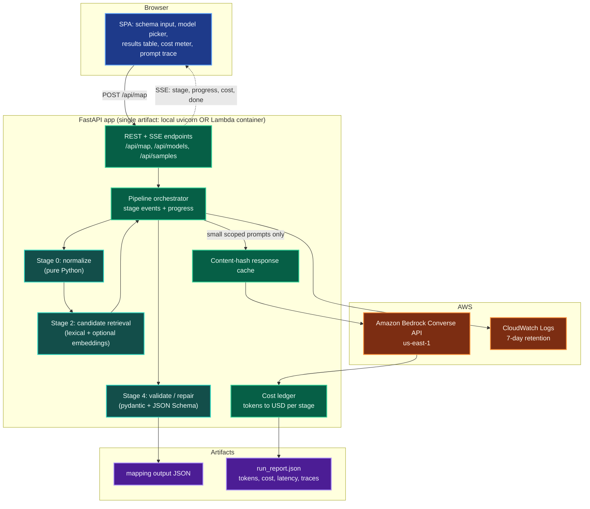
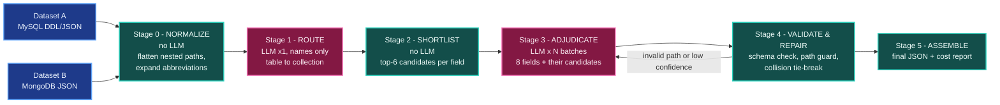
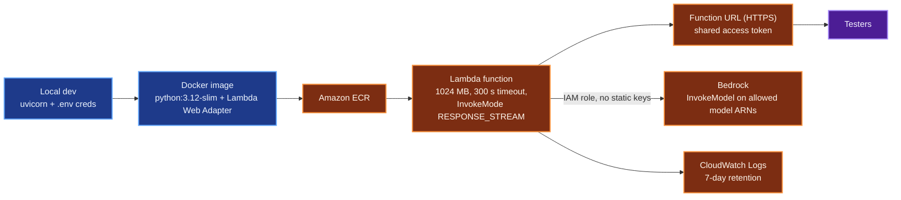

# Schema Field Mapper - Design & Delivery Plan

**Assignment:** map every field of a legacy MySQL HR schema (`legacy_hrm`) to its semantic equivalent in a modern MongoDB schema (`people_platform`), emitting one JSON document with per-field `source_field`, `destination_field` (dot notation), `type_transform`, `confidence`, `reasoning`, `notes`.

**Hard constraint from the assignment:** *you cannot pass both schemas to an LLM in a single prompt and receive a finished mapping.* Every design decision below flows from that.

**Stack decisions (confirmed):**

- LLM: **Amazon Bedrock** (region `us-east-1`, confirmed available), Converse API for a single code path across model families.
- Backend: **FastAPI** (Python 3.12) with Server-Sent Events for live progress.
- Frontend: single-page app served by the same FastAPI app (React 18 + Tailwind via CDN, no build step).
- Deployment: **AWS Lambda container image + Function URL** with response streaming (scales to zero).
- Model policy: **quality first** - default to a strong Claude model for the reasoning stage, cheap Nova models for mechanical stages, full model switching and live cost display in the UI.

---

## 1. Why the pipeline is decomposed (the constraint)

A naive solution pastes both schemas into one prompt. That is forbidden, and it is also genuinely worse: it invites hallucinated destination paths, gives no confidence calibration, and produces one giant blob you cannot validate or retry field-by-field.

Instead the work is split so **no single prompt ever contains more than a thin slice of one schema**:

- Stage 1 sees only *table names and column-name lists* (no types, no comments) to decide which table pairs with which collection.
- Stage 3 sees, per call, *one batch of ~8 source fields from one table* plus, for each of those fields, only its *top-6 pre-shortlisted destination paths*.
- Stage 4 tie-breaks see only the two conflicting candidates.

The heavy lifting of "which destination paths are even plausible" is done **deterministically in code** (Stage 2), which is cheaper, faster, auditable, and makes hallucinated paths impossible to slip through.

## 2. System architecture

> Every diagram in this document appears twice: a plain-text flowchart that reads correctly anywhere, and the same graph as mermaid for a rich preview (`Ctrl+Shift+V`). The mermaid versions will also be exported to `project_plans/diagrams/*.png` and `*.svg` via `npx -y @mermaid-js/mermaid-cli` and embedded as images, so the colored form works in the raw editor, on GitHub, and in the write-up.

```text
                    +---------------------------------------------+
                    |               BROWSER (SPA)                 |
                    |  schema input | model picker | results grid |
                    |  cost meter   | prompt trace                |
                    +------+--------------------------+-----------+
                           | POST /api/map            ^ SSE events
                           v                          |
 +-------------------------+--------------------------+----------------------+
 |            FASTAPI APP   (local uvicorn OR Lambda container)              |
 |                                                                          |
 |  +---------------+     +----------------+     +---------------------+     |
 |  | [0] NORMALIZE |---->| [2] SHORTLIST  |---->| [4] VALIDATE/REPAIR |     |
 |  |    no LLM     |     |    no LLM      |     |      no LLM         |     |
 |  +-------+-------+     +-------+--------+     +----------+----------+     |
 |          |                     |                         |               |
 |          +----------+----------+                         |               |
 |                     v                                    |               |
 |          +------------------------+                      |               |
 |          |     ORCHESTRATOR       |                      |               |
 |          +----+--------------+----+                      |               |
 |               | prompt       ^ reply                      |              |
 |               v              |                            |              |
 |     +------------------+  +--+---------------+            |              |
 |     | RESPONSE CACHE   |  |   COST LEDGER    |            |              |
 |     +--------+---------+  +--------+---------+            |              |
 +--------------|--------------------|----------------------|---------------+
                | InvokeModel        ^ token usage          v
                v                    |            +----------------------+
     +--------------------------+     |            |  outputs/            |
     |     AMAZON BEDROCK       |-----+            |   mapping_*.json     |
     |  Converse API, us-east-1 |                  |   run_report.json    |
     +--------------------------+                  +----------------------+
```

Same graph in mermaid:



## 3. Pipeline stages

```text
      +--------------------+          +----------------------+
      | Dataset A: MySQL   |          | Dataset B: MongoDB   |
      |    legacy_hrm      |          |   people_platform    |
      +---------+----------+          +----------+-----------+
                |                                |
                +----------------+---------------+
                                 v
          +--------------------------------------------------+
          | [0] NORMALIZE                          no LLM    |
          | flatten nested paths to dot notation,            |
          | expand abbreviations, build valid path set       |
          +-----------------------+--------------------------+
                                  v
          +--------------------------------------------------+
          | [1] ROUTE                              LLM  x1   |
          | in : table names + column NAMES only             |
          | out: 3 table -> collection pairings              |
          +-----------------------+--------------------------+
                                  v
          +--------------------------------------------------+
          | [2] SHORTLIST                          no LLM    |
          | top-6 destination paths per source field,        |
          | scored inside its matched collection only        |
          +-----------------------+--------------------------+
                                  v
          +--------------------------------------------------+
          | [3] ADJUDICATE                         LLM  xN   |<--+
          | one call per ~8 source fields, each field        |   |
          | carrying only its own 6 candidates + null        |   | repair
          +-----------------------+--------------------------+   | retry
                                  v                              |
          +--------------------------------------------------+   |
          | [4] VALIDATE & REPAIR                  no LLM    +---+
          | JSON Schema, hallucinated-path guard,            |
          | collision tie-break, coverage assertion          |
          +-----------------------+--------------------------+
                                  v
          +--------------------------------------------------+
          | [5] ASSEMBLE                           no LLM    |
          +----------+----------------------------+----------+
                     v                            v
          +---------------------+     +-------------------------+
          |   mapping JSON      |     |    run_report.json      |
          | required contract   |     | tokens, USD, traces     |
          +---------------------+     +-------------------------+
```

Same graph in mermaid:



### Stage 0 - Normalize (deterministic)

Parse both schemas into an intermediate representation. MongoDB nesting is flattened to dot-notation paths up front, which is what makes `fullName.firstName` a first-class candidate rather than something the model has to invent.

```python
SourceField(table, name, sql_type, nullable, key, fk_target, comment)
DestField(collection, path, bson_type, comment, is_ref)
```

Also builds an abbreviation lexicon used by Stage 2 (`f_name` -> first name, `dob` -> date of birth, `cd` -> code, `nm` -> name, `dt` -> date, `ts` -> timestamp, `sal` -> salary, `mgr` -> manager, `lvl` -> level, `stat` -> status, `ctr` -> center, `tz` -> timezone).

### Stage 1 - Table routing (1 cheap LLM call)

Prompt carries only table names + bare column-name lists and collection names + top-level field names. Returns the three pairings with confidence and one-sentence reasoning. Runs on **Nova Lite** - it is a 3-way matching problem, not a reasoning problem.

### Stage 2 - Candidate shortlisting (deterministic, free)

For each source field, score **only destination paths inside its matched collection**:

- normalized token overlap after abbreviation expansion,
- trigram / Jaro-Winkler string similarity,
- type-compatibility bonus (`DATE`/`DATETIME` -> `ISODate`, `TINYINT(1)` -> `Boolean`, `CHAR(1)` -> `String` enum, `INT PK/FK` -> `ObjectId`),
- key-role bonus (PK -> `_id`, FK -> `*Id` ref paths),
- optional Bedrock **Titan Embeddings v2** cosine similarity (toggle in UI, ~$0.00002 per run).

Keeps top 6. This is the cost lever: prompts stay ~300-500 tokens instead of thousands.

### Stage 3 - Field adjudication (LLM, batched)

One call per ~8 source fields of one table. Each field arrives with its own shortlist plus an explicit `null` option for "no good match". Output is forced through a **Converse tool-use JSON schema**, so the response is structurally valid by construction. Temperature 0. Runs on the user-selected mapper model (default Claude Sonnet class).

Returned `destination_field` is checked against the Stage 0 path set - a path that does not exist cannot survive.

### Stage 4 - Validate & repair (deterministic + at most tiny LLM calls)

- pydantic + JSON Schema validation of every record against the required output contract,
- hallucinated-path guard, with a single-field retry for anything rejected,
- collision resolution when two source fields claim one destination path (highest confidence wins; if within 0.05, one tiny tie-break call containing just that pair),
- coverage assertion: every source field appears either in `field_mappings` or in `unmapped_source_fields`, and every destination path appears either as a target or in `unmapped_destination_fields`. This is what guarantees the assignment's "every field across all three source tables".

### Stage 5 - Assemble

Emits `outputs/mapping_legacy_hrm_to_people_platform.json` exactly in the required shape, plus `outputs/run_report.json` with per-stage model, token counts, latency, USD cost, cache hits, and the full text of every prompt sent (the prompt trace doubles as evidence that the constraint was respected).

## 4. Cost model

Live us-east-1 on-demand rates, per 1M tokens, held in a registry so the UI can price any run:

- Amazon Nova Micro - $0.035 in / $0.14 out
- Amazon Nova Lite - $0.06 in / $0.24 out
- Amazon Nova Pro - $0.80 in / $3.20 out
- Claude Haiku 4.5 - $1.00 in / $5.00 out
- Claude Sonnet 4.6 - $3.00 in / $15.00 out
- Titan Embeddings v2 - $0.02 in

A full 3-table run is roughly 12-18k input and 4-6k output tokens after shortlisting:

- Nova Lite router + Claude Sonnet mapper: **~$0.10-0.14 per run**
- Nova Lite router + Claude Haiku mapper: **~$0.03-0.05 per run**
- All Nova Lite: **~$0.002 per run**

Infrastructure is effectively free: Lambda at 1 GB for ~30 s per run stays inside the free tier for demo traffic, Function URLs cost nothing, ECR storage for a ~400 MB image is about **$0.04/month**, and CloudWatch logs are capped with 7-day retention. Expect **under $1/month** all-in for a shared demo, dominated by whatever Bedrock tokens testers spend.

Guardrails: reserved concurrency of 2, a per-run token ceiling, an AWS Budgets alert at $5, and a shared access token on the Function URL so the demo link cannot be used to burn your Bedrock quota.

## 5. UI

Single page, three panels:

- **Input** - paste or drop a source schema (MySQL DDL or JSON) and a destination schema (MongoDB JSON or a sample document), or click "Load assignment sample". Parse-check happens before any spend.
- **Run** - model pickers for router / mapper / tie-break roles, embeddings toggle, cache toggle, estimated cost before you press Run, then a live SSE progress log per stage.
- **Results** - per-table cards with coverage chips, a sortable field-mapping table with color-coded confidence bands, expandable reasoning and notes, unmapped-field lists, raw JSON preview with copy/download, a cost breakdown table, and a "prompt trace" drawer showing exactly what was sent to each model.

## 6. Deployment

```text
   +----------------------+        +-----------------------------------+
   | Local dev            |        | Docker image                      |
   | uvicorn + .env creds |------->| python:3.12-slim +                |
   +----------------------+        | AWS Lambda Web Adapter            |
                                   +-----------------+-----------------+
                                                     | docker push
                                                     v
                                   +-----------------------------------+
                                   | Amazon ECR                        |
                                   +-----------------+-----------------+
                                                     | sam deploy
                                                     v
   +----------------------+        +-----------------------------------+
   | Testers (browser)    |<------>| Function URL (HTTPS)              |
   +----------------------+        | shared access token               |
                                   +-----------------+-----------------+
                                                     v
                                   +-----------------------------------+
                                   | AWS LAMBDA                        |
                                   | 1024 MB | 300 s | RESPONSE_STREAM |
                                   +------+---------------------+------+
                                          |                     |
                                          v                     v
                        +------------------------+   +------------------------+
                        | Amazon Bedrock         |   | CloudWatch Logs        |
                        | execution role only,   |   | 7-day retention        |
                        | allowed model ARNs     |   +------------------------+
                        +------------------------+
```

Same graph in mermaid:



Lambda is the right fit here: the workload is bursty demo traffic, idle cost is zero, and the Lambda Web Adapter lets the identical FastAPI app run locally and in Lambda with SSE streaming intact. Deployment is a SAM template (`infra/template.yaml`) plus `sam deploy --guided`.

Prerequisites to install before deploying: AWS CLI (`winget install Amazon.AWSCLI`) and SAM CLI (`pip install aws-sam-cli`). Docker is already present.

**EC2 alternative** (documented, not default): same container on a `t4g.small` behind Caddy for TLS. Simpler to reason about and fine on free tier, but always-on and roughly $6-12/month afterwards, plus you own patching and TLS renewal.

## 7. Repository layout

```
.env.example                     # documented placeholders, no secrets
requirements.txt
project_plans/schema_field_mapper_plan.md
project_plans/diagrams/          # architecture|pipeline|deployment .mmd + .png + .svg + render.ps1
data/schemas/legacy_hrm.mysql.json
data/schemas/people_platform.mongo.json
src/schema_mapper/
  config.py        # env, model registry + pricing, role defaults
  models.py        # pydantic contract for the output JSON
  normalize.py     # Stage 0
  candidates.py    # Stage 2
  prompts.py       # per-stage templates
  bedrock.py       # Converse client, retries, usage capture, cache
  pipeline.py      # orchestrator, emits progress events
  validate.py      # Stage 4
  cost.py          # token -> USD ledger
  cli.py           # headless run, same code path as the API
api/main.py        # FastAPI + SSE
api/static/index.html
tests/             # normalize, candidates, validate, contract, golden output
infra/Dockerfile, infra/template.yaml, infra/DEPLOY.md
outputs/           # generated mapping + run report
docs/WRITEUP.md    # required write-up
```

## 8. Secrets handling

`.env` stays gitignored (already covered by `.gitignore`) and is used for local dev only. In Lambda, Bedrock access comes from the execution role, not from keys. A new `.env.example` documents what is needed:

```
AWS_DEFAULT_REGION=us-east-1
AWS_ACCESS_KEY_ID=your-access-key-id          # local dev only
AWS_SECRET_ACCESS_KEY=your-secret-access-key  # local dev only
BEDROCK_MAPPER_MODEL=us.anthropic.claude-sonnet-4-6-v1:0
BEDROCK_ROUTER_MODEL=us.amazon.nova-lite-v1:0
BEDROCK_EMBEDDING_MODEL=amazon.titan-embed-text-v2:0
ENABLE_EMBEDDINGS=true
ENABLE_RESPONSE_CACHE=true
MAX_TOKENS_PER_RUN=120000
APP_ACCESS_TOKEN=change-me-for-shared-demo
LOG_LEVEL=INFO
```

Model IDs are validated at startup against `bedrock:ListFoundationModels` / inference profiles, so a wrong or not-yet-enabled model surfaces as a clear error in the UI rather than a runtime 400 mid-run.

## 9. Deliverables mapped to the assignment

- **Working pipeline code** - `src/schema_mapper/` plus a headless CLI and the FastAPI/UI wrapper.
- **Generated output JSON** - `outputs/mapping_legacy_hrm_to_people_platform.json`, committed.
- **Write-up** - `docs/WRITEUP.md`: prompt structure per stage, how the single-prompt constraint shaped the decomposition, why retrieval is deterministic, confidence calibration, cost/model trade-offs, and what would change at production scale.

## 10. Build order

0. Export the three diagrams to PNG/SVG under `project_plans/diagrams/` and embed them here.
1. Normalized schema fixtures + IR + tests.
2. Output contract models and JSON Schema validation.
3. Bedrock Converse client with usage capture, retries, cache, and cost ledger.
4. Deterministic candidate retrieval + tests.
5. Prompts and orchestrator for Stages 1, 3, 4, 5; produce the committed output JSON via CLI.
6. FastAPI API with SSE + the SPA.
7. Dockerfile, SAM template, deploy notes, budget guardrails.
8. Write-up and README.
